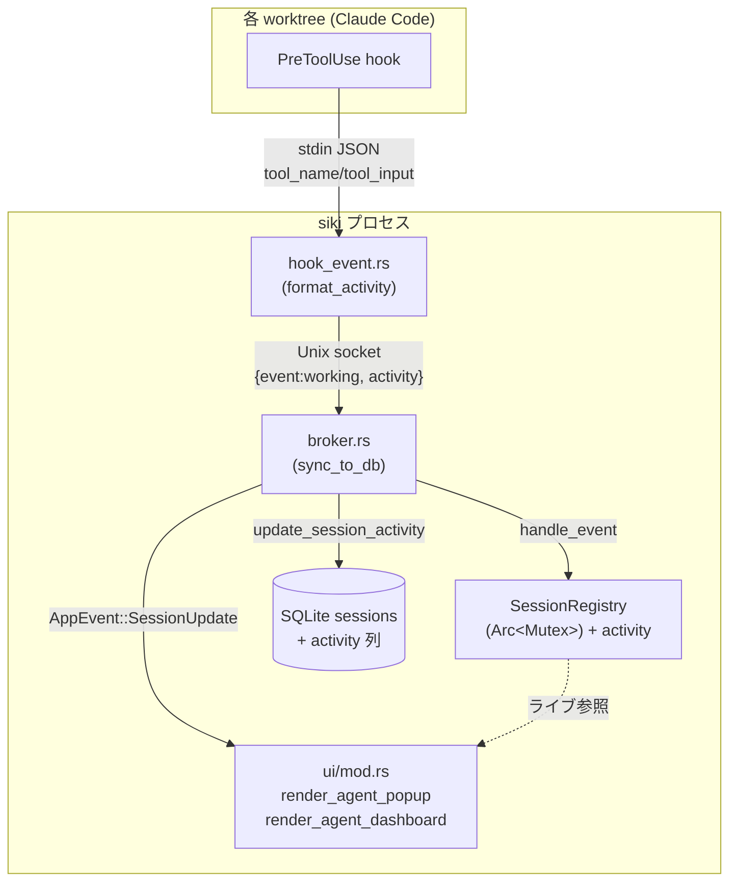

# エージェント監視システム アーキテクチャ設計

**作成日**: 2026-06-23
**関連要件定義**: [requirements.md](../../spec/agent-monitoring-system/requirements.md)
**ヒアリング記録**: [design-interview.md](design-interview.md)

**【信頼性レベル凡例】**:
- 🔵 **青信号**: EARS要件定義書・設計文書・ユーザヒアリング・既存コードを参考にした確実な設計
- 🟡 **黄信号**: 上記資料から妥当な推測による設計
- 🔴 **赤信号**: 上記資料にない推測による設計

---

## システム概要 🔵

**信頼性**: 🔵 *requirements.md 概要・コードベース調査より*

siki の既存セッション監視基盤（hook → broker → SessionRegistry/SQLite → TUI）を拡張し、(1) PreToolUse hook からツール単位のアクティビティ（activity）を取得・保持し、(2) 左ペインの専用ホットキー（`m`/`M`）から開く2つの監視ビュー（プロジェクト別ポップアップ・全体ダッシュボード）でリアルタイム表示する。

本機能は**新規プロセス・新規スレッド・新規通信経路を一切追加しない**。既存の状態収集経路に「activity」というデータを1つ載せ、既存のポップアップ描画パターンにビューを2つ足すだけの**加算的拡張**である。

## アーキテクチャパターン 🔵

**信頼性**: 🔵 *既存コード構造・CLAUDE.md（単一責任/YAGNI）より*

- **パターン**: 既存の **イベント駆動 + 二層状態（インメモリ Registry + SQLite 永続）** を踏襲。レイヤは「hook 送信（CLIサブコマンド）／ broker（受信・配信）／ 状態（Registry・DB）／ UI（ratatui 描画）」。
- **選択理由**: 既存アーキテクチャが既にリアルタイム状態配信（遅延 1s 未満）を実現しており、要件（REQ-101 リアルタイム更新）を追加コストなく満たせる。新パターン導入は YAGNI に反する。

## コンポーネント構成

本機能の変更は既存6ファイルへの**加算的修正**に閉じる。新規ファイルは作らない（単一責任の範囲内で既存モジュールに帰属させる）。

### データ収集層（hook 送信側） 🔵

**信頼性**: 🔵 *`hook_event.rs` 調査・ヒアリング（レベルB / description優先）より*

- **対象**: `src/hook_event.rs`
- **変更**: `working`（PreToolUse）イベント処理時に stdin JSON から `tool_name` / `tool_input` を抽出し、`format_activity()`（新規ヘルパ）で人間可読な1行に整形して broker 送信 payload に `activity` を追加する。
- **整形ルール**（ヒアリング確定）:
  - `Bash` → `description` 優先、無ければ `command`（例「Bash: テスト実行」）
  - `Edit`/`Write`/`MultiEdit`/`Read`/`NotebookEdit` → `file_path` のベース名（例「Edit: session.rs」）
  - `Task` → `subagent_type` ＋ `description`（例「Task(Explore): …」）
  - その他 → `tool_name` のみ
- **制約**: 抽出は同期・軽量に留め、stdin タイムアウト（1s）＋ broker タイムアウト合計 < hook timeout（5s）を侵さない（REQ-403）。

### 配信層（broker） 🔵

**信頼性**: 🔵 *`broker.rs` 調査より*

- **対象**: `src/broker.rs`
- **変更**: `sync_to_db()` の `Working` 分岐で activity を DB に保存（`update_session_activity`）。`handle_event` 経由で Registry にも activity を反映。SessionUpdate 送信ロジックは不変（UI は Registry をライブ参照するため payload 拡張は不要）。

### 状態層（Registry・DB） 🔵

**信頼性**: 🔵 *`session.rs` / `db.rs` 調査より*

- **対象**: `src/session.rs`, `src/db.rs`
- **`session.rs`**:
  - `HookEvent::Working` に `#[serde(default)] activity: Option<String>` を追加（後方互換: REQ-401）。
  - `Session` 構造体に `activity: Option<String>` を追加。
  - `handle_event(Working)` で activity が `Some` のとき `Session.activity` を更新。**他状態（idle/done/refresh）では activity を保持**（REQ-103: 直前を残す）。`Dead` はセッションごと削除。
- **`db.rs`**:
  - 既存の冪等 `ALTER TABLE sessions ADD COLUMN activity TEXT;` を追加（REQ-402）。
  - `update_session_activity(conn, session_id, activity)` を新設。

### UI 層（描画・入力） 🔵

**信頼性**: 🔵 *`ui/mod.rs` / `app.rs` / `main.rs` の既存ポップアップパターン調査より*

- **対象**: `src/ui/mod.rs`, `src/app.rs`, `src/main.rs`
- **`app.rs`**: ポップアップ状態フィールドを追加（`show_agent_popup` / `agent_popup_project_index` / `agent_popup_scroll` / `show_agent_dashboard` / `agent_dashboard_scroll`）。
- **`ui/mod.rs`**: `render_agent_popup`（centered_rect 60×50）と `render_agent_dashboard`（centered_rect 80×80）を新設し、`render()` のポップアップ分岐に追加。両者とも `session_registry: &SessionRegistry` をライブ参照する。
- **`main.rs`**: 左ペインのキーディスパッチに `m`（カーソル位置プロジェクトのポップアップ）と `M`（全体ダッシュボード）を追加。表示中は他ペイン操作を早期 return で横取りし、`Esc` で閉じ、`j`/`k` でスクロール。ヘルプにキーを追記。

## システム構成図 🔵

**信頼性**: 🔵 *既存アーキテクチャ・コードより*



太線が本機能の追加データ経路（activity）。点線は既存のライブ参照（変更なし）。

## ディレクトリ構造 🔵

**信頼性**: 🔵 *既存プロジェクト構造より*

```
src/
├── hook_event.rs   # ← activity 抽出 (format_activity)
├── session.rs      # ← HookEvent::Working.activity / Session.activity
├── broker.rs       # ← sync_to_db で activity 永続
├── db.rs           # ← ALTER TABLE + update_session_activity
├── app.rs          # ← 監視ビューのポップアップ状態
├── main.rs         # ← m/M キーディスパッチ・Esc/jk・help
└── ui/
    └── mod.rs      # ← render_agent_popup / render_agent_dashboard
```

新規ファイルなし。各変更は対応する既存モジュールの責務内に収まる（単一責任）。

## 非機能要件の実現方法

### パフォーマンス 🔵

**信頼性**: 🔵 *NFR-001/002・`broker.rs` 既存特性より*

- **反映遅延**: 既存 broker 経路（Unix socket ローカル）をそのまま使うため 1s 未満を維持（NFR-001）。
- **描画負荷**: ビューは 100ms Tick の再描画で更新。1回の描画で Registry を1パス走査（O(セッション数)）＋ソートのみ。セッション数は実運用で高々数十のため Tick 予算内（NFR-002）。
- **activity 抽出**: hook 側で文字列1本を生成するだけ。正規表現・外部呼び出しなし（REQ-403 タイムアウト遵守）。

### セキュリティ 🔵

**信頼性**: 🔵 *NFR-101/102・`session.rs` より*

- **ローカル完結**: activity はインメモリ + SQLite のみに保持。外部送信なし（NFR-101）。
- **パストラバーサル**: project/worktree 名は既存 `guess_names_from_cwd` / `is_safe_segment` の防御を流用（NFR-102）。activity 文字列は表示専用で、ファイルパス join 等には使わない。
- **表示サニタイズ**: activity は改行・制御文字を1行に正規化してから保持（EDGE-002）。長文は省略（EDGE-102）。

### スケーラビリティ 🟡

**信頼性**: 🟡 *NFR から妥当な推測*

- セッション数が表示領域を超える場合は `j`/`k` スクロールで対応（REQ-301、ヒアリング確定）。本ツールの想定規模（1ユーザー・数十セッション）では十分。

### 可用性 🟡

**信頼性**: 🟡 *既存挙動からの妥当な推測*

- activity は Registry の他フィールドと同じライフサイクル（5分無応答で削除、SessionEnd で削除）に従う。siki 再起動時は DB の activity 列から復元可能だが、Registry 再構築の主経路は既存どおり hook 再登録に依存する（本機能で可用性要件は新設しない）。

## 技術的制約

### 互換性制約 🔵

**信頼性**: 🔵 *REQ-401/402・`session.rs:600` 既存テストより*

- hook payload は後方互換。`activity` は `#[serde(default)]` の Optional とし、従来形式 `{"event":"working","session_id":"x"}` のデシリアライズを壊さない（既存 `test_valid_hook_states_deserialize` を維持）。
- DB マイグレーションは冪等 `ALTER TABLE ADD COLUMN`（既存の claude_session_id / alert と同じパターン）。

### パフォーマンス制約 🔵

**信頼性**: 🔵 *`hook_event.rs:9-23` より*

- 状態系 hook の stdin タイムアウト 1s ＋ broker connect/write タイムアウトの合計が hook timeout（5s）を下回ること。activity 抽出処理を同期重処理にしない。

### 設計・コーディング制約 🔵

**信頼性**: 🔵 *CLAUDE.md・coding-style.md より*

- 日本語コメント、1ファイル800行以内、深いネスト回避、エラーは文脈付きで処理、ミューテーション最小化。
- 完了主張前に `cargo test` / `cargo build` の実行結果（exit code・件数）で検証（verification.md）。

## 主要設計判断（トレードオフ）

| 判断 | 採用 | 理由 | 信頼性 |
|------|------|------|--------|
| UI のデータ取得元 | Registry をライブ参照（AppEvent payload は拡張しない） | 既存 SessionUpdate を変えず影響範囲を最小化。100ms Tick で十分にリアルタイム | 🔵 *既存 render が registry を受領* |
| activity の保持先 | Registry（UI 源泉）＋ DB（永続・将来の MCP 連携余地） | UI は Registry で完結、DB は再起動耐性。二層は既存踏襲 | 🔵 *既存二層構造* |
| activity 抽出位置 | hook_event.rs（送信側） | broker を薄く保つ。Claude payload 構造を知るのは hook 側が自然 | 🟡 *妥当な推測* |
| 完了後の activity | クリアせず直前を保持 | ヒアリング確定（REQ-103） | 🔵 *ヒアリング* |
| unknown セッション | ダッシュボードに表示 | 取りこぼし防止・異常検知（ヒアリング確定） | 🔵 *ヒアリング* |

## 関連文書

- **データフロー**: [dataflow.md](dataflow.md)
- **型定義（Rust）**: [interfaces.rs](interfaces.rs)
- **DBスキーマ（SQLite）**: [database-schema.sql](database-schema.sql)
- **ヒアリング記録**: [design-interview.md](design-interview.md)
- **要件定義**: [requirements.md](../../spec/agent-monitoring-system/requirements.md)

> **api-endpoints.md は生成しない**: 本機能は HTTP API を持たない TUI 機能であり、内部の hook/broker プロトコル（Unix socket の1行 JSON）は dataflow.md と interfaces.rs に記載する。

## 信頼性レベルサマリー

- 🔵 青信号: 21件 (88%)
- 🟡 黄信号: 3件 (12%)
- 🔴 赤信号: 0件 (0%)

**品質評価**: 高品質（既存コードに根拠を持つ加算的設計。🟡 はスケーラビリティ/可用性の運用想定と抽出位置のみ）
