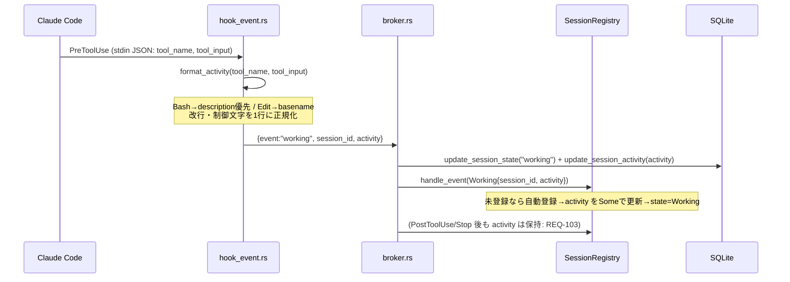
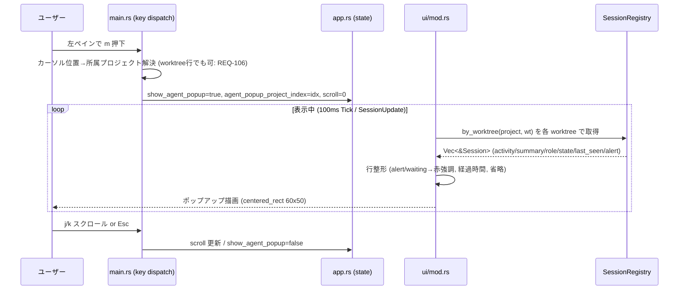
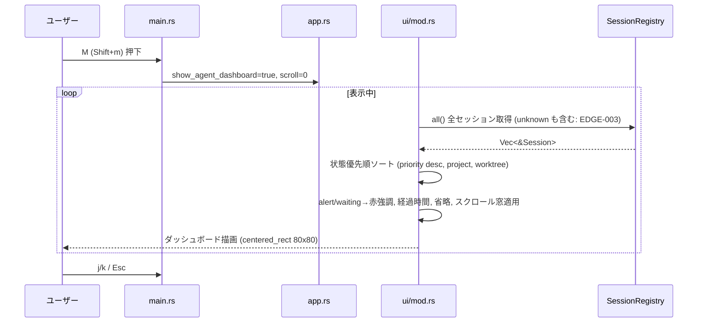
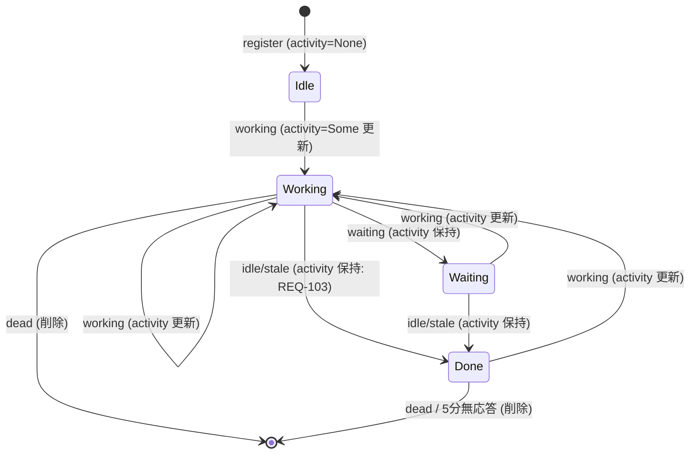
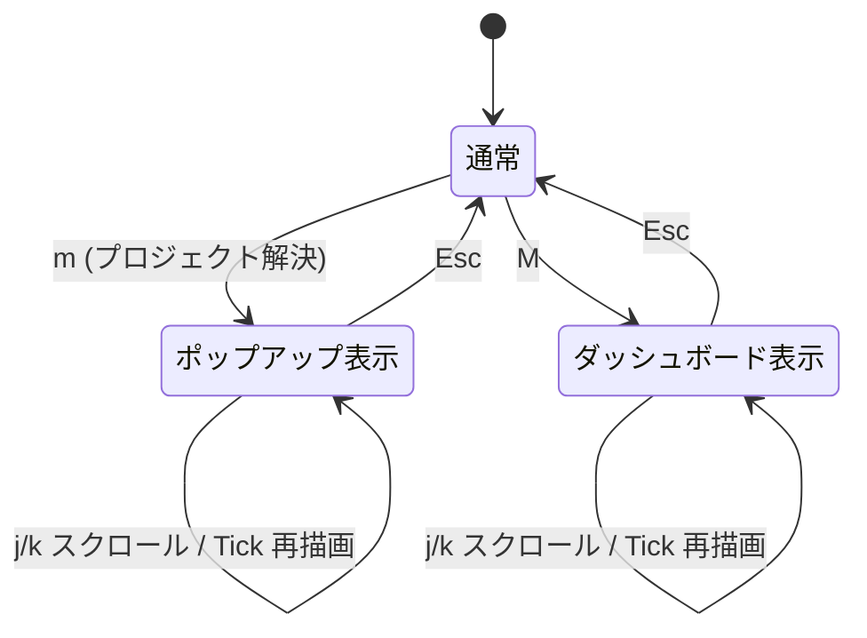
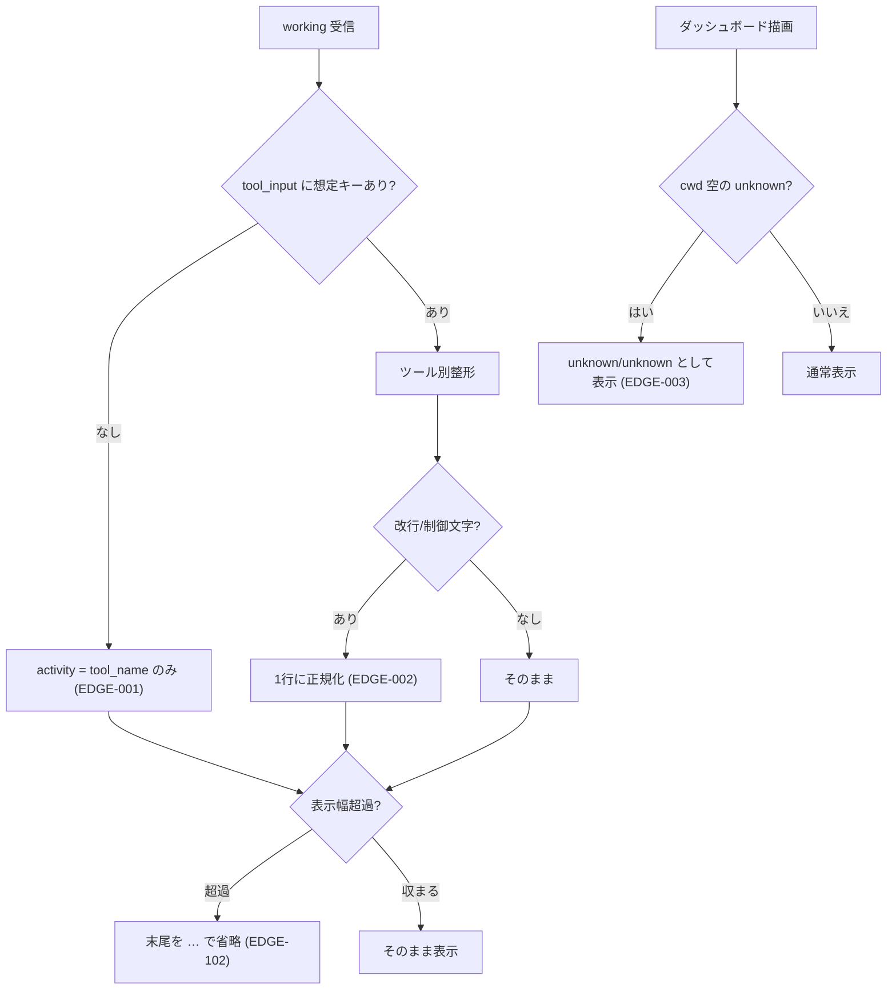

# エージェント監視システム データフロー図

**作成日**: 2026-06-23
**関連アーキテクチャ**: [architecture.md](architecture.md)
**関連要件定義**: [requirements.md](../../spec/agent-monitoring-system/requirements.md)

**【信頼性レベル凡例】**:
- 🔵 **青信号**: EARS要件定義書・設計文書・ユーザヒアリング・既存コードを参考にした確実なフロー
- 🟡 **黄信号**: 上記資料から妥当な推測によるフロー
- 🔴 **赤信号**: 上記資料にない推測によるフロー

---

## システム全体のデータフロー 🔵

**信頼性**: 🔵 *requirements.md・コードベース調査より*

```mermaid
flowchart TD
    A[Claude Code エージェント] -->|"PreToolUse hook<br/>tool_name/tool_input"| B["siki hook-event working<br/>(hook_event.rs)"]
    B -->|format_activity| C["{event:working,<br/>session_id, activity}"]
    C -->|Unix socket| D["Broker (broker.rs)"]
    D -->|update_session_activity| E[("SQLite sessions.activity")]
    D -->|handle_event| F["SessionRegistry<br/>Session.activity"]
    D -->|AppEvent::SessionUpdate| G["TUI イベントループ"]
    G -->|再描画 (100ms Tick含む)| H["render()"]
    F -.->|ライブ参照| H
    H --> I["render_agent_popup / render_agent_dashboard"]
    I --> J[ユーザー]
```

## 主要機能のデータフロー

### 機能1: ツール活動（activity）の取得・保持 🔵

**信頼性**: 🔵 *ユーザーストーリー2.1・受け入れ基準 TC-001 より*

**関連要件**: REQ-001, REQ-002, REQ-102, REQ-103



**詳細ステップ**:
1. エージェントがツール実行直前に PreToolUse hook を発火し、`siki hook-event working` に `tool_name`/`tool_input` を含む JSON を stdin で渡す。
2. `format_activity()` が tool_name 別ルールで1行の activity を生成（改行・制御文字を除去/正規化、長文は後段表示で省略）。
3. broker が DB の `state`/`activity` を更新し、Registry の `Session.activity` を更新（working へ遷移）。
4. PostToolUse（refresh）/ Stop（idle）が来ても activity はクリアせず保持（直前の作業が見える）。

### 機能2: プロジェクト別ポップアップ表示（`m`） 🔵

**信頼性**: 🔵 *ユーザーストーリー1.1・受け入れ基準 TC-003 より*

**関連要件**: REQ-003, REQ-005, REQ-106, REQ-201



**詳細ステップ**:
1. 左ペインで `m` を押す。カーソルが worktree 行でも、その worktree が属するプロジェクトに解決（REQ-106）。
2. ポップアップ状態をオンにし、対象プロジェクトの index を保持。
3. 描画は対象プロジェクトの各 worktree について `SessionRegistry::by_worktree()` を呼び、セッション行を整形表示。表示中は他ペインのキーを横取り（REQ-201）。
4. `j`/`k` でスクロール、`Esc` で閉じる。アクティブセッションが無ければ「アクティブなエージェントなし」を表示（REQ-202）。

### 機能3: 全体ダッシュボード表示（`M`） 🔵

**信頼性**: 🔵 *ユーザーストーリー1.2・受け入れ基準 TC-004 より*

**関連要件**: REQ-004, REQ-006, EDGE-003



**詳細ステップ**:
1. `M` で全体ダッシュボードを開く。
2. `SessionRegistry::all()` の全セッション（unknown/unknown も表示: EDGE-003）を取得。
3. 状態優先順（waiting > working > done > idle、`SessionState::priority()` 降順）→ project 名 → worktree 名 でソート（REQ-006）。
4. スクロール窓を適用して描画。`Esc` で閉じる。

## データ処理パターン

### 同期処理 🔵

**信頼性**: 🔵 *`hook_event.rs`・`broker.rs` より*

- hook の activity 抽出（`format_activity`）は同期・軽量。broker への送信も既存の直列経路。

### 非同期処理 🔵

**信頼性**: 🔵 *`broker.rs` 既存構造より*

- broker は接続ごとに `tokio::spawn`。DB 書き込み・Registry 更新・SessionUpdate 送信は既存どおり。本機能で非同期構造は変更しない。

### バッチ処理 🔵

**信頼性**: 🔵 *該当なし*

- バッチ処理は不要（イベント駆動で完結）。

## 状態管理フロー

### activity を含むセッション状態遷移 🔵

**信頼性**: 🔵 *`session.rs` の既存状態機械 + REQ-103 より*



**ポイント**: activity が更新されるのは `working`（PreToolUse）受信時のみ。それ以外の遷移では**直前の activity を保持**（REQ-103）。`dead`（SessionEnd）や 5 分無応答でセッションごと削除されると activity も消える。

### UI 表示状態（ポップアップ/ダッシュボード） 🔵

**信頼性**: 🔵 *既存ポップアップパターンより*



## エラー・エッジケースのフロー 🟡

**信頼性**: 🟡 *EDGE-001/002/003・既存実装パターンからの妥当な推測*



## hook/broker プロトコル仕様（内部「API」相当） 🔵

**信頼性**: 🔵 *`hook_event.rs` / `session.rs` HookEvent / `broker.rs` より*

HTTP API は無いが、本機能が触る唯一の境界プロトコルが broker への1行 JSON。activity 追加後の `working` メッセージ：

```json
{ "event": "working", "session_id": "abc123", "activity": "Edit: session.rs" }
```

- `activity` は **任意（Optional）**。従来形式 `{"event":"working","session_id":"abc123"}` も引き続き受理（REQ-401）。
- 他イベント（`waiting`/`refresh`/`idle`/`dead`/`register`）の形式は不変。
- broker 側 `HookEvent::Working { session_id, activity: Option<String> }` にデシリアライズ。

## 関連文書

- **アーキテクチャ**: [architecture.md](architecture.md)
- **型定義（Rust）**: [interfaces.rs](interfaces.rs)
- **DBスキーマ（SQLite）**: [database-schema.sql](database-schema.sql)
- **要件定義**: [requirements.md](../../spec/agent-monitoring-system/requirements.md)

## 信頼性レベルサマリー

- 🔵 青信号: 11件 (85%)
- 🟡 黄信号: 2件 (15%)
- 🔴 赤信号: 0件 (0%)

**品質評価**: 高品質（全フロー既存コードに接地。🟡 はエッジ整形の挙動推測のみ）
