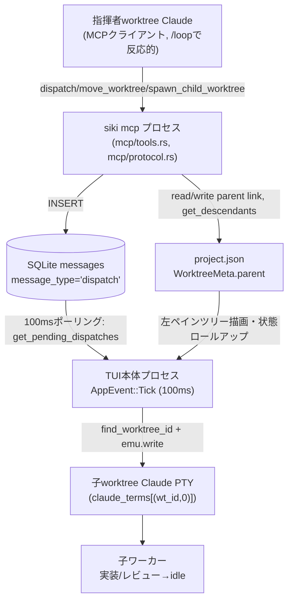

# 指揮者階層アーキテクチャ 技術設計

**作成日**: 2026-07-02
**関連要件定義**: [requirements.md](../../spec/conductor-hierarchy/requirements.md)
**ヒアリング記録**: [design-interview.md](design-interview.md)

**【信頼性レベル凡例】**:
- 🔵 **青信号**: 要件定義書・実地コード調査（Exploreエージェント）を根拠とした確実な設計
- 🟡 **黄信号**: 上記から妥当な推測による設計（実装時の追加確認を推奨）
- 🔴 **赤信号**: 上記にない推測による設計

---

## システム概要 🔵

**信頼性**: 🔵 *requirements.md 概要より*

siki 本体（Rust製TUI、ratatui + tokio + crossterm、rusqlite、MCP stdioサーバー）に、既存の「人間が介在するpeer-to-peerメッセージング」機構の上へ、**指揮者worktreeが子worktreeへ自動的にプロンプトを投入し、状況を集約する**機構を追加する。DBスキーマは変更せず（NFR-002）、FSは2階層（project/worktree）を維持し（REQ-011）、親子関係は `project.json` の `WorktreeMeta.parent` 論理リンクのみで表現する。

## アーキテクチャ方針 🔵

**信頼性**: 🔵 *既存実装（db.rs / mcp/tools.rs / main.rs / config.rs / app.rs）の構造より*

- **パターン**: 既存の「MCPプロセス（`siki mcp`、短命）が SQLite にINSERT → TUI本体プロセスが100ms Tickでポーリング → インメモリ状態へ反映」という非同期ブリッジ構造を踏襲する。新規のスレッド・タイマー・IPC経路は追加しない（NFR-001）。
- **既存3レイヤの拡張**: (1) DB層 (`db.rs`) にdispatch専用クエリを追加、(2) MCPツール層 (`mcp/tools.rs`, `mcp/protocol.rs`) に `dispatch`/`move_worktree`/`spawn_child_worktree` を追加、(3) TUI本体 (`main.rs`, `app.rs`, `config.rs`, `ui/left_panel.rs`, `session.rs`) に配送・階層モデル・描画を追加。
- **親子リンクの一次ソース**: `project.json`（`ProjectMeta.worktrees: HashMap<String, WorktreeMeta>`）。`WorktreeMeta` に `parent: Option<String>` を追加する（REQ-010, REQ-011）。
- **識別子の使い分け**: 永続化・MCP越しの参照は必ず `(project_name, worktree_name)` の文字列ペアを使う。`WorktreeId = (usize, usize)`（`app.rs:11`）は `add`/`remove` 時に再インデックスされ**安定しない**ため、DBやproject.jsonには絶対に保存しない（`design-interview.md` 訂正2, 6 のコード調査結果より）🔵。

## コンポーネント別の変更点

### 1. dispatch専用DBクエリ（`src/db.rs`） 🔵

**信頼性**: 🔵 *design-interview.md訂正・既存 `messages` スキーマ（db.rs:34-45）より*

既存 `messages` テーブル（スキーマ変更なし）に対し、以下を追加する。

```rust
/// dispatch専用の未読メッセージを取得する（REQ-002）
/// 既存 get_pending_messages とは異なり、message_type='dispatch' のみを対象とする
pub fn get_pending_dispatches(conn: &Connection) -> Result<Vec<DispatchRow>> {
    let mut stmt = conn.prepare(
        "SELECT id, to_worktree, to_project, content
         FROM messages
         WHERE read_at IS NULL AND message_type = 'dispatch'
         ORDER BY created_at ASC",
    )?;
    let rows = stmt.query_map([], |row| {
        Ok(DispatchRow {
            id: row.get(0)?,
            to_worktree: row.get(1)?,
            to_project: row.get(2)?,
            content: row.get(3)?,
        })
    })?;
    let mut result = Vec::new();
    for row in rows {
        result.push(row?);
    }
    Ok(result)
}
```

`DispatchRow` 型は [interfaces.rs](interfaces.rs) 参照。既読化は**新規関数を追加しない**。既存の `mark_messages_read`（`db.rs:304-313`、id指定で `to_session` 条件なしに無条件既読化）をそのまま再利用する 🔵 *design-interview.md訂正より、dispatchは1行=1受信者のfanout設計のため無条件既読化で安全*。

既存 `get_pending_messages`（`db.rs:270-301`）のWHERE句に以下を追加し、dispatchが通常の保留メッセージ経路へ混入しないようにする（REQ-007）:

```sql
-- 変更前: WHERE read_at IS NULL AND (to_session = ?1 OR to_worktree = ?2 OR to_project = ?3 OR (...))
-- 変更後: 先頭に AND message_type != 'dispatch' を追加
WHERE read_at IS NULL AND message_type != 'dispatch'
  AND (to_session = ?1 OR to_worktree = ?2 OR to_project = ?3 OR (...))
```

既存回帰テスト（`tools.rs:621-688` 相当, `session_start.rs:376-425` 相当）は dispatch行が混入しないことを踏まえて期待値更新が必要 🔵 *note.md注意事項*。

### 2. 親子階層モデル（`src/config.rs`） 🔵

**信頼性**: 🔵 *design-interview.md調査（config.rs:341-346, 246-266, 448-452, 386-435）より*

`WorktreeMeta`（`config.rs:341-346`）に `parent` を追加する。既存フィールドと同じ `#[serde(default, skip_serializing_if = "Option::is_none")]` パターンを踏襲し、後方互換を保つ（既存 `project.json` に `parent` キーが無くても `None` にデシリアライズされる）:

```rust
#[derive(Debug, Clone, Deserialize, Serialize)]
pub struct WorktreeMeta {
    #[serde(default, skip_serializing_if = "Option::is_none")]
    pub display_name: Option<String>,
    #[serde(default, skip_serializing_if = "Option::is_none")]
    pub parent: Option<String>,  // 🔵 REQ-010: 同一project内の親worktree名
}
```

**永続化関数**: 既存 `finalize_add_worktree`（`main.rs:2179`付近）が参照している `config::save_worktree_display_name(project, worktree, Some(name))` と同型の新規関数 `save_worktree_parent` を追加する 🟡 *`save_worktree_display_name` 自体の実装は本ラウンドで直接確認できていないため、実装時に既存関数の正確なパターン（load→`entry().or_default()`→フィールド更新→書き戻し）を踏襲すること*:

```rust
/// worktree の親リンクを設定する（REQ-012）。循環参照は呼び出し側(set_worktree_parent)で事前検証すること。
pub fn save_worktree_parent(project_name: &str, worktree_name: &str, parent: Option<&str>) -> Result<()> {
    let mut meta = load_project_meta(project_name).unwrap_or_default(); // 🟡 ProjectMeta: Default導出が必要
    let entry = meta.worktrees.entry(worktree_name.to_string()).or_default();
    entry.parent = parent.map(|s| s.to_string());
    // save_project_meta と同じ書き込みロジック（source_path込みで書き直すため、
    // 既存の save_project_meta(project_name, path) は path 引数が必須で用途が異なる。
    // worktrees マップのみを更新する専用の書き込みヘルパを別途用意する 🟡）
    write_project_meta(project_name, meta)
}
```

**循環参照ガード + 子孫解決**（REQ-015, REQ-018）: 新規モジュール関数（`config.rs` または新設 `src/hierarchy.rs`）。

```rust
/// project_name 内で root_worktree の子孫（子・孫...）の名前一覧をDFSで返す（REQ-018）
pub fn get_descendants(project_name: &str, root_worktree: &str) -> Vec<String> {
    let Some(meta) = load_project_meta(project_name) else { return Vec::new() };
    let mut result = Vec::new();
    let mut stack = vec![root_worktree.to_string()];
    let mut visited = std::collections::HashSet::new(); // 🟡 防御的: データ破損時の無限ループ防止
    while let Some(current) = stack.pop() {
        for (name, wt_meta) in &meta.worktrees {
            if wt_meta.parent.as_deref() == Some(current.as_str()) && visited.insert(name.clone()) {
                result.push(name.clone());
                stack.push(name.clone());
            }
        }
    }
    result
}

/// 付け替え前の循環参照チェック（REQ-015）
/// new_parent が child 自身、または child の子孫である場合 true（付け替え禁止）
pub fn would_create_cycle(project_name: &str, child: &str, new_parent: &str) -> bool {
    new_parent == child || get_descendants(project_name, child).iter().any(|d| d == new_parent)
}
```

### 3. 親削除時の子の独立化（REQ-016） 🟡

**信頼性**: 🟡 *design-interview.md残課題: 既存のworktree削除処理の正確な関数名は本ラウンドで未特定*

worktree削除処理（左ペイン `d` キー相当、既存の再インデックス処理 `reindex_worktree_maps` を伴う箇所、`main.rs:4591-4640`付近と推定）の冒頭で、削除対象worktree名を親に持つ全worktreeを走査し `parent = None` を設定する:

```rust
// 削除対象 `removed_name` の直接の子全員を独立化する（孫以下は元々 removed_name を parent としていないため対象外、
// 実質的に「親を1段だけ失う」形になり子孫のさらに下の階層構造は保持される）
for (name, wt_meta) in project_meta.worktrees.iter_mut() {
    if wt_meta.parent.as_deref() == Some(removed_name) {
        wt_meta.parent = None;
    }
}
```

**実装時の要確認事項** 🔴: worktree削除処理の正確な関数・行番号の特定、および削除処理内で `project.json` を書き戻すタイミング（既存の削除フローに書き込みステップがあるか、新規追加が必要か）は `/tsumiki:kairo-tasks` でのタスク分割時に確定する。EDGE-002（親削除と子削除の同時競合）も同様に本設計では未規定のまま残す。

### 4. `Worktree`/`Project` へのフィールド追加（`src/app.rs`） 🔵

**信頼性**: 🔵 *design-interview.md調査（app.rs:226-265, 697-734）より*

`Worktree` 構造体（`app.rs:226-255`）に `parent` を追加し、TUI描画層から親子関係を参照できるようにする:

```rust
pub struct Worktree {
    // ...既存フィールド...
    pub parent: Option<String>,  // 🔵 REQ-010〜014: 親worktree名（同一project内）
}
```

**2つの構築箇所を同時に更新する必要がある**（既存の `display_name` と同じ扱い）:
- `Project::from_config`（`app.rs:697-734`、`fn from_config`）: `config::load_worktree_meta(&pc.name, &wc.name).and_then(|m| m.parent)` で読み込む
- `finalize_add_worktree`（`main.rs:2122-2223`）: 新規worktree作成時は `parent: None`（Phase3の `spawn_child_worktree` 経由の場合のみ、生成直後に `save_worktree_parent` で別途設定・反映する。REQ-023）

### 5. dispatch配送（`src/main.rs` `AppEvent::Tick`） 🔵

**信頼性**: 🔵 *design-interview.md調査（main.rs:1677-1717, 30, 185, 4293-4308）+ 訂正2・5より*

`claude_terms: HashMap<(WorktreeId, usize), TerminalEmulator>` と同じスコープ（`main()` 内イベントループのローカル変数）に、リトライカウンタを追加する:

```rust
let mut dispatch_retry_counts: HashMap<i64, u32> = HashMap::new(); // dispatch_id -> リトライ回数
const DISPATCH_RETRY_LIMIT: u32 = 30; // 🔵 design-interview.md Q1: 約3秒(100ms×30)
```

`AppEvent::Tick` ハンドラ（`main.rs:1677-1717`、既存のアラート同期直後）に配送ロジックを追加する:

```rust
// dispatch配送（REQ-002〜006）
if let Ok(conn) = broker_db.lock() {
    if let Ok(dispatches) = db::get_pending_dispatches(&conn) {
        for d in dispatches {
            let (Some(to_wt), Some(to_proj)) = (&d.to_worktree, &d.to_project) else { continue }; // 不整合行は無視
            let resolved = app.find_worktree_id(to_proj, to_wt)          // 🔵 新規実装(下記)
                .and_then(|wt_id| claude_terms.get_mut(&(wt_id, 0)).map(|emu| (wt_id, emu)));

            match resolved {
                Some((_wt_id, emu)) if emu.is_alive() => {                // 🔵 訂正5: is_alive()必須
                    let msg = format!("{}\n", d.content);
                    if emu.write(msg.as_bytes()).is_ok() {
                        let _ = db::mark_messages_read(&conn, &[d.id]);    // 既存関数を再利用
                        dispatch_retry_counts.remove(&d.id);
                    }
                    // write失敗時は既読化しない → 次Tickで再度この分岐に到達しリトライされる
                }
                _ => {
                    // 対象worktreeが存在しない(EDGE-001) または PTY未生成・非aliveの場合(REQ-005)
                    let count = dispatch_retry_counts.entry(d.id).or_insert(0);
                    *count += 1;
                    if *count >= DISPATCH_RETRY_LIMIT {
                        let _ = db::mark_messages_read(&conn, &[d.id]);
                        dispatch_retry_counts.remove(&d.id);
                        // REQ-006: set_alert相当の人間向け通知（既存 app.show_error 等の枠組みを利用）🟡
                        app.show_error(format!(
                            "dispatch配送に失敗しました（{}回リトライ後に断念）: {} -> {}",
                            DISPATCH_RETRY_LIMIT, to_proj, to_wt
                        ));
                    }
                }
            }
        }
    }
}
```

**新規ヘルパー**（`app.rs` への `impl App` 追加、design-interview.md訂正2で判明した欠落を埋める）:

```rust
impl App {
    /// (project_name, worktree_name) から現在の WorktreeId を解決する（REQ-002）。
    /// WorktreeId は add/remove で再インデックスされ不安定なため、呼び出しの都度解決すること
    /// （キャッシュしてはならない）。
    pub fn find_worktree_id(&self, project_name: &str, worktree_name: &str) -> Option<WorktreeId> {
        self.projects.iter().enumerate().find_map(|(pi, p)| {
            if p.name != project_name {
                return None;
            }
            p.worktrees
                .iter()
                .position(|w| w.name == worktree_name)
                .map(|wi| (pi, wi))
        })
    }
}
```

**新規アクセサ**（`src/terminal.rs`、design-interview.md訂正5）:

```rust
impl TerminalEmulator {
    /// PTYプロセスが生存しているか（dispatch配送の成功判定に使用。write()は非aliveでもOk(())を返すため必須）
    pub fn is_alive(&self) -> bool {
        self.alive
    }
}
```

### 6. subtree dispatch + 状態集約（Phase2） 🔵

**信頼性**: 🔵 *design-interview.md調査（tools.rs:31-147, session.rs:203-219,271-275）より*

`dispatch` MCPツール（[mcp-tools.md](mcp-tools.md)参照）は `target.type == "subtree"` の場合、**呼び出し時点**で `config::get_descendants` を解決し、子孫それぞれに対して個別に `messages` 行をINSERTする（TUI側の配送ロジックは Phase0 と完全に同一のまま、1子=1行の単純な繰り返しで対応できる。design-interview.md訂正4と同様、target種別ごとの分岐はMCPツール層に閉じ込め、TUI配送層は関与しない）。

`list_sessions` の `scope` 分岐（`tools.rs:31-147` 内の既存 `match scope { "worktree"=>.., "project"=>.., _=>.. }`）に `"children"` を追加する（REQ-019）:

```rust
"children" => {
    let descendants = config::get_descendants(proj, wt);
    all_sessions
        .iter()
        .filter(|s| s.project_name == proj && descendants.contains(&s.worktree_name))
        .collect()
}
```

左ペインの状態ロールアップ（REQ-020）は `SessionRegistry` の既存メソッド（`aggregate_state`, `has_alert`、いずれも `(project, worktree)` を受け線形走査するO(n)実装、`session.rs:203-219,271-275`）を子孫名の集合に対して繰り返し呼び出す形で実現し、新規インデックス構造は追加しない:

```rust
// ui/left_panel.rs のバッジ計算部に追加
let descendants = config::get_descendants(project_name, &wt.name); // 子がいなければ空Vec
let subtree_state = descendants.iter()
    .filter_map(|d| session_registry.and_then(|r| r.aggregate_state(project_name, d)))
    .max_by_key(|s| s.priority());
let subtree_alert = descendants.iter()
    .any(|d| session_registry.map(|r| r.has_alert(project_name, d)).unwrap_or(false));
// 最終的なバッジ状態 = 自分自身の状態/アラートと subtree_state/subtree_alert の優先度マージ
```

### 7. 左ペインのツリー描画（Phase1） 🔵

**信頼性**: 🔵 *design-interview.md調査（left_panel.rs:8-13, 31-45, 131-133, 160-169）より*

`ListEntry`（`left_panel.rs:8-13`、現状 `Project`/`Worktree` の2バリアントのみでフラット）に `depth` を追加する:

```rust
pub enum ListEntry {
    Project { index: usize },
    Worktree { project_index: usize, worktree_index: usize, depth: usize }, // 🔵 REQ-014
}
```

`build_entries`（`left_panel.rs:31-45`、現状は `project.worktrees` を単純ループするだけでフラット）を、`parent` リンクに基づく親子DFSへ変更する:

```rust
pub fn build_entries(projects: &[Project]) -> Vec<ListEntry> {
    let mut entries = Vec::new();
    for (pi, project) in projects.iter().enumerate() {
        entries.push(ListEntry::Project { index: pi });
        if !project.collapsed {
            // parent名 -> 子のworktree_indexリスト（挿入順=既存Vec順を保持）
            let mut children_of: HashMap<Option<&str>, Vec<usize>> = HashMap::new();
            for (wi, wt) in project.worktrees.iter().enumerate() {
                children_of.entry(wt.parent.as_deref()).or_default().push(wi);
            }
            fn dfs(
                pi: usize, parent_key: Option<&str>, depth: usize,
                worktrees: &[Worktree], children_of: &HashMap<Option<&str>, Vec<usize>>,
                entries: &mut Vec<ListEntry>,
            ) {
                if let Some(children) = children_of.get(&parent_key) {
                    for &wi in children {
                        entries.push(ListEntry::Worktree { project_index: pi, worktree_index: wi, depth });
                        dfs(pi, Some(worktrees[wi].name.as_str()), depth + 1, worktrees, children_of, entries);
                    }
                }
            }
            dfs(pi, None, 0, &project.worktrees, &children_of, &mut entries); // ルート = parent:None
        }
    }
    entries
}
```

**防御的な循環対策** 🟡: `project.json` が外部改変等で循環を含んでいた場合に無限再帰しないよう、`dfs` に `visited: &mut HashSet<usize>` を追加し訪問済みwiを再訪問しない（`would_create_cycle` による事前ガードがあるため通常経路では発生しないが、防御的多層化として推奨）。

`is_last`（`left_panel.rs:131-133`、現状「project内の最後のworktreeか」）を「同じ親を持つ兄弟内で最後か」に変更し、インデント（`left_panel.rs:160-169`、現状固定2スペース + `branch_char`）を `depth` 依存にする:

```rust
let prefix = format!("{}{} ", "  ".repeat(entry_depth), branch_char); // 🔵 depthでインデント可変化
```

## システム構成図 🔵

**信頼性**: 🔵 *既存データフロー + 本設計より*



## 非機能要件の実現方法

### パフォーマンス 🔵

**信頼性**: 🔵 *NFR-001より*

既存100ms Tickサイクル内で完結させ、新規スレッド・タイマーを追加しない。`get_descendants`/`aggregate_state`はO(n)線形走査だが、siki の想定worktree数（数十〜百程度）ではTick予算(100ms)に対し無視できるコスト 🟡。

### セキュリティ 🔵

**信頼性**: 🔵 *NFR-101、design-interview.md訂正1より*

dispatch完全自動投入であっても、危険ツール実行はClaude Code CLI自体の組み込み権限承認システムでゲートされ続ける（siki hookはゲートに関与しない、訂正1参照）。

### スケーラビリティ 🟡

**信頼性**: 🟡 *要件から妥当な推測*

cross-project階層は禁止（EDGE-102）のためスケール対象は単一project内のworktree数に限定される。

## 技術的制約

### FS/DB制約 🔵

**信頼性**: 🔵 *note.md確定制約1, 2*

- FSは2階層(project/worktree)を維持し、ディレクトリ3階層化は行わない
- DBスキーマは変更しない（既存 `messages.message_type` 列のみ利用）

### 識別子の安定性制約 🔵

**信頼性**: 🔵 *design-interview.md訂正6、app.rs:11*

`WorktreeId=(usize,usize)` は再インデックスされ不安定。永続化・MCP越しの参照は必ず `(project_name, worktree_name)` 文字列を使う。

## 関連文書

- **データフロー**: [dataflow.md](dataflow.md)
- **Rust型定義**: [interfaces.rs](interfaces.rs)
- **MCPツール仕様**: [mcp-tools.md](mcp-tools.md)
- **要件定義**: [requirements.md](../../spec/conductor-hierarchy/requirements.md)

## 信頼性レベルサマリー

- 🔵 青信号: 大半（DB層・MCP層・TUI配送・階層モデル・ツリー描画・状態集約はすべて実地コード調査で裏付け済み）
- 🟡 黄信号: 5件（親削除フックの正確な位置、`save_worktree_display_name`同型実装、循環対策の多層防御、スケール上限、Tick予算への影響見積もり）
- 🔴 赤信号: 1件（親削除処理の実装箇所は次フェーズでの特定待ち）

**品質評価**: 高品質（主要設計は実地コード調査で裏付け済み。残る🟡🔴はいずれも「実装時に確認すれば即座に解消できる」性質の局所的な未確定事項）
