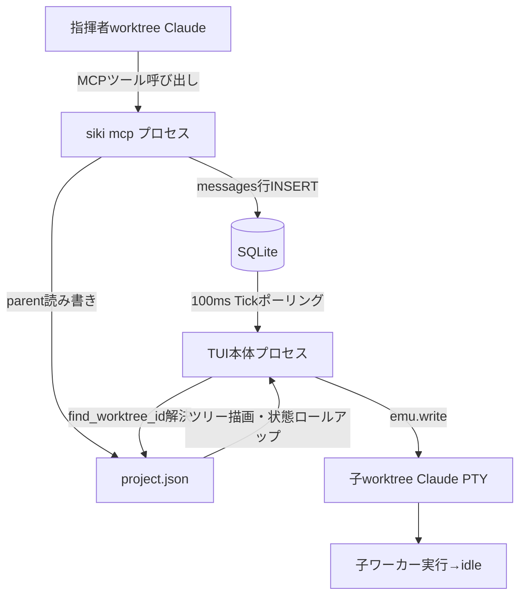
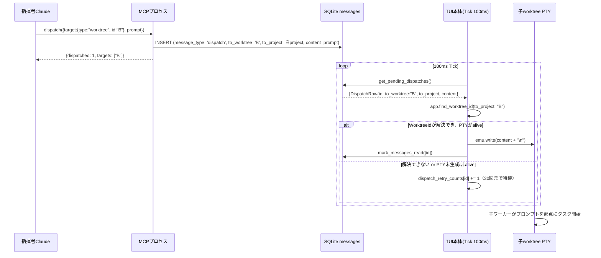
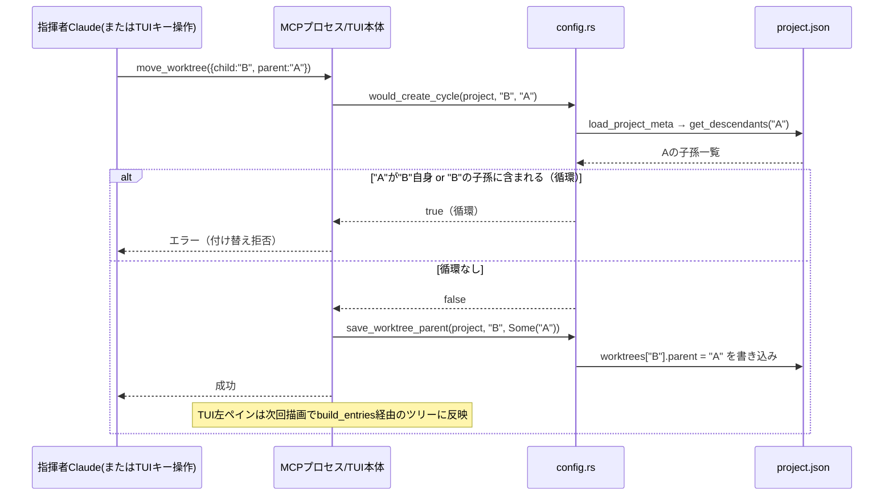
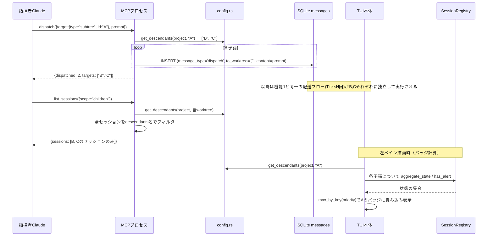
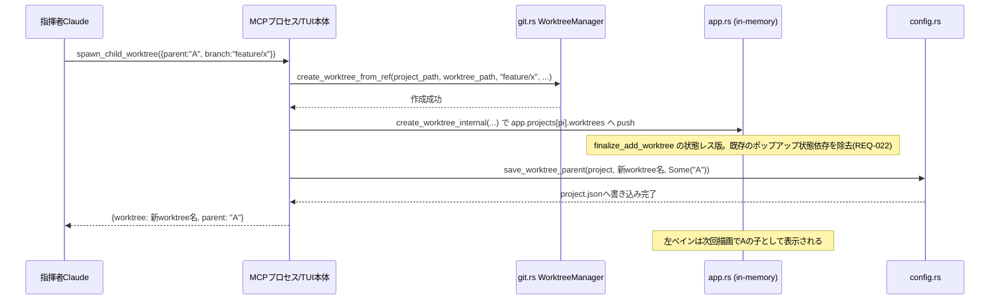
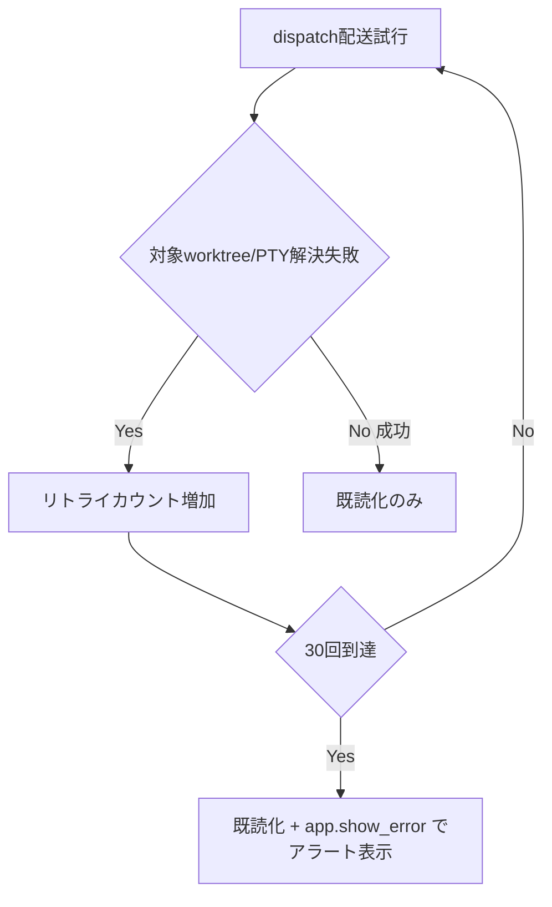

# 指揮者階層アーキテクチャ データフロー図

**作成日**: 2026-07-02
**関連アーキテクチャ**: [architecture.md](architecture.md)
**関連要件定義**: [requirements.md](../../spec/conductor-hierarchy/requirements.md)

**【信頼性レベル凡例】**:
- 🔵 **青信号**: 要件定義書・実地コード調査を根拠とした確実なフロー
- 🟡 **黄信号**: 上記から妥当な推測によるフロー
- 🔴 **赤信号**: 上記にない推測によるフロー

---

## システム全体のデータフロー 🔵

**信頼性**: 🔵 *architecture.md システム構成図より*



## 主要機能のデータフロー

### 機能1: dispatch（worktree単体への自動投入） 🔵

**信頼性**: 🔵 *REQ-001〜003、architecture.md セクション1・5より*

**関連要件**: REQ-001, REQ-002, REQ-003, REQ-004



**詳細ステップ**:
1. 指揮者Claudeが `dispatch` MCPツールを呼ぶ（target.type="worktree"）
2. MCPプロセスが `messages` に1行INSERTし、即座に `{dispatched:1}` を返す（非同期・fire-and-forget）
3. TUI本体が次回Tickで未読dispatchを取得し、`find_worktree_id`でWorktreeIdを解決
4. 対象PTYが存在しalive状態なら書き込み・既読化、そうでなければリトライカウントを進める

---

### 機能2: dispatchのリトライ〜アラート発報 🔵

**信頼性**: 🔵 *REQ-005, REQ-006、architecture.md セクション5より*

**関連要件**: REQ-005, REQ-006, EDGE-001, EDGE-101

```mermaid
flowchart TD
    A[Tick: dispatch未読行を取得] --> B{find_worktree_id解決可能?}
    B -->|不可 EDGE-001| C[リトライカウント+1]
    B -->|可能| D{claude_terms[(wt_id,0)]存在 かつ is_alive?}
    D -->|不可 REQ-005| C
    D -->|可能| E[emu.write実行]
    E --> F{write成功?}
    F -->|Yes| G[mark_messages_read + カウンタ削除]
    F -->|No| C
    C --> H{カウント >= 30 REQ-006?}
    H -->|No| I[次Tickで再試行]
    H -->|Yes EDGE-101| J[mark_messages_read + カウンタ削除 + アラート発報]
```

**備考**: EDGE-001（worktree不存在）とREQ-005（PTY未生成）は同一のリトライ経路に統合されている（`find_worktree_id`が`None`を返すケースと`claude_terms`にエントリが無い/非aliveのケースを同じ`_`分岐で扱う、architecture.mdセクション5参照）。

---

### 機能3: move_worktree（親子付け替え・循環ガード） 🔵

**信頼性**: 🔵 *REQ-012, REQ-015、architecture.md セクション2より*

**関連要件**: REQ-012, REQ-013, REQ-015



---

### 機能4: subtree dispatch + 状態ロールアップ + list_sessions(scope=children) 🔵

**信頼性**: 🔵 *REQ-017〜021、architecture.md セクション6より*

**関連要件**: REQ-017, REQ-018, REQ-019, REQ-020, REQ-021



**部分失敗の扱い**（REQ-021）: 上記INSERTループはCがループを止めずB, C双方へ独立にINSERTするため、Bへの配送がPTY未生成でリトライ中でも、Cへの配送には一切影響しない（機能1のリトライ機構がdispatch_id単位で独立して動作するため）🟡。

---

### 機能5: spawn_child_worktree（指揮者による子生成） 🔵

**信頼性**: 🔵 *REQ-022, REQ-023、既存 finalize_add_worktree（main.rs:2122-2223）より*

**関連要件**: REQ-022, REQ-023



---

## データ処理パターン

### 非同期処理 🔵

**信頼性**: 🔵 *既存アーキテクチャ（MCPプロセスは短命・fire-and-forget、TUI本体は100ms Tick）より*

MCPツール呼び出しはDBへのINSERT/更新のみで完結し、実際のPTY投入はTUI本体の非同期Tickに委譲する（既存 `send_message`/`broadcast` と同一パターン）。

### ポーリング 🔵

**信頼性**: 🔵 *NFR-001より*

dispatch配送・アラート同期はいずれも既存の100ms `AppEvent::Tick` 内に実装し、専用の定期タスクは追加しない。

## エラーハンドリングフロー 🔵

**信頼性**: 🔵 *REQ-005, REQ-006, EDGE-001より*



move_worktreeの循環拒否・cross-project拒否（EDGE-102）はMCPツール呼び出しの同期エラーレスポンスとして即座に指揮者Claudeへ返る（Tick経由の非同期エラーにはならない）🔵。

## データ整合性の保証 🟡

**信頼性**: 🟡 *NFR-002・design-interview.md残課題より*

- **project.jsonの書き込み**: `save_worktree_parent`は既存 `save_worktree_display_name` と同型の read-modify-write（ロック機構は既存実装同様、ファイルシステムレベルの排他制御は行わない） 🟡
- **dispatchの既読化**: `mark_messages_read`はid指定の無条件更新のため、TUI本体プロセスが単一である限り競合は発生しない 🔵
- **親削除時のNone化**（REQ-016）とその実装箇所の同時書き込みタイミングはEDGE-002として本設計でも未規定 🔴

## 関連文書

- **アーキテクチャ**: [architecture.md](architecture.md)
- **Rust型定義**: [interfaces.rs](interfaces.rs)
- **MCPツール仕様**: [mcp-tools.md](mcp-tools.md)

## 信頼性レベルサマリー

- 🔵 青信号: 12件 (80%)
- 🟡 黄信号: 2件 (13%)
- 🔴 赤信号: 1件 (7%、EDGE-002)

**品質評価**: 高品質
