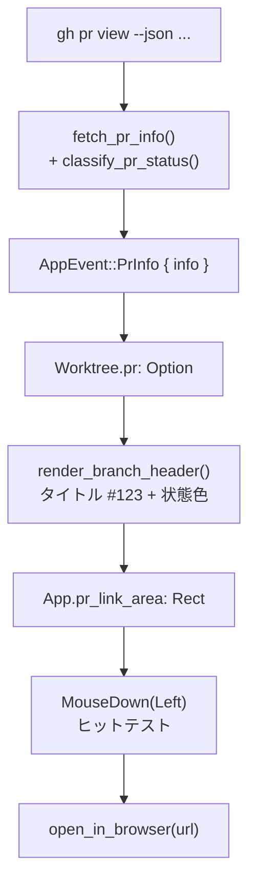

# PRヘッダー強化 アーキテクチャ設計（軽量設計）

**作成日**: 2026-06-23
**関連要件定義**: [requirements.md](../../spec/pr-header-enhancement/requirements.md)
**ヒアリング記録**: [design-interview.md](design-interview.md)

**【信頼性レベル凡例】**:
- 🔵 **青信号**: 要件定義・ユーザヒアリング・既存実装を参考にした確実な設計
- 🟡 **黄信号**: 要件・既存実装から妥当な推測による設計
- 🔴 **赤信号**: 根拠のない推測による設計

---

## システム概要 🔵

**信頼性**: 🔵 *requirements.md 概要より*

siki TUI の中央ペイン上部ヘッダー（`render_branch_header`）を拡張し、PR の **番号表示**・
**状態別の色分け**・**クリックでブラウザ起動** を実現する。既存の PR 情報取得・イベント・
描画・マウス処理の各レイヤに最小侵襲で機能を足し込む。

## アーキテクチャ方針 🔵

**信頼性**: 🔵 *既存実装（app.rs / main.rs / event.rs / main_panel.rs）の構造より*

- **パターン**: 既存の単方向データフロー（非同期取得 → `AppEvent` → `App` 状態更新 → 描画）を踏襲。
  新規レイヤは追加せず、既存4ファイルを拡張する。
- **データ拡張**: `Worktree.pr_title: Option<String>` を `Worktree.pr: Option<PrInfo>` に置換し、
  番号・URL・状態を一括保持する（単一責任：PR に関する表示情報を1つの値型に集約）。
- **判定の分離**: `gh` の JSON から状態（`PrStatus`）を導く処理を**純粋関数**に切り出し、
  I/O（`gh` 実行）とロジック（状態判定）を分離してユニットテスト可能にする。
- **イミュータブル**: `PrInfo` は生成後に変更せず、再取得時は新しい値で丸ごと置き換える。

## データモデル（Rust 型定義） 🔵

**信頼性**: 🔵 *requirements.md REQ-001/002 + gh JSON フィールドより*

`src/app.rs` に追加する型：

```rust
/// PR の表示用状態（色分けの優先順位順に判定する）
/// 優先: CiError > Approved > Draft > Ready  （REQ-002）
#[derive(Debug, Clone, Copy, PartialEq, Eq)]
pub enum PrStatus {
    CiError,   // CI 失敗（赤）       — 最優先
    Approved,  // レビュー承認済み（緑）
    Draft,     // ドラフト（グレー）
    Ready,     // オープン/レビュー待ち（イエロー）
}

/// ブランチに紐づく GitHub PR の表示情報
#[derive(Debug, Clone)]
pub struct PrInfo {
    pub number: u32,        // 🔵 REQ-001 番号表示
    pub title: String,      // 🔵 既存 pr_title 相当
    pub url: String,        // 🔵 REQ-003 クリック遷移先
    pub status: PrStatus,   // 🔵 REQ-002 色分け
}
```

`Worktree` の変更（`src/app.rs:225`）：

```rust
// 変更前: pub pr_title: Option<String>,
pub pr: Option<PrInfo>,        // 🔵 PR 情報を集約
```

`App` に追加するクリック領域記録（既存 `claude_content_area: Option<Rect>` と同パターン）：

```rust
pub pr_link_area: Option<Rect>,  // 🔵 ヘッダーの PR 部分の矩形（クリック判定用、毎フレーム再計算）
```

> 色（ratatui `Color`）は描画層の関心事のため `app.rs` には持たせず、`main_panel.rs` 側で
> `PrStatus` を `Color` に変換する（REQ-402 の非フォーカス時グレー化もここで処理）。🔵

## 状態判定ロジック（純粋関数） 🔵

**信頼性**: 🔵 *requirements.md REQ-002 状態判定の詳細より*

`src/main.rs` に純粋関数として実装し、`gh pr view --json ...` のパース結果（`serde_json::Value`
または専用 struct）を受けて `PrStatus` を返す。優先順位を厳守する。

```text
fn classify_pr_status(is_draft, review_decision, status_check_rollup) -> PrStatus:
    1. status_check_rollup に失敗系が1件でもある → CiError      (REQ-002, 最優先)
       失敗系: CheckRun.conclusion ∈ {FAILURE, TIMED_OUT, ACTION_REQUIRED}
               StatusContext.state ∈ {FAILURE, ERROR}
       ※ pending/running（SUCCESS でも FAILURE でもない）は失敗扱いしない (REQ-002 pending)
    2. review_decision == "APPROVED"                            → Approved
    3. is_draft == true                                         → Draft
    4. それ以外                                                  → Ready
```

この関数を I/O から分離することで、JSON 文字列入力 → `PrStatus` のユニットテストが書ける
（受け入れ基準 REQ-001/002 のテストケースに対応）。

## コンポーネント別の変更点

### 1. PR 情報取得（`src/main.rs`） 🔵

**信頼性**: 🔵 *既存 fetch_pr_title (main.rs:5313) より*

- `fetch_pr_title` → `fetch_pr_info(wt_path) -> Option<PrInfo>` に変更
- 取得コマンド: `gh pr view --json number,title,url,isDraft,reviewDecision,statusCheckRollup`
- 標準出力の JSON を `serde_json` でパース → `classify_pr_status` で状態決定 → `PrInfo` を構築
- PR 無し / `gh` 失敗時は従来通り `None`（REQ-403）
- 取得タイミングは**既存3トリガーのみ**（`main.rs:249` 起動時 / `702` セッション完了後 /
  `2161` worktree追加時）。新規ポーリングは追加しない（REQ-401）🔵

### 2. イベント（`src/event.rs`） 🔵

**信頼性**: 🔵 *既存 AppEvent::PrInfo (event.rs:41) より*

```rust
// 変更前: PrInfo { worktree_id, title: Option<String> }
PrInfo { worktree_id: WorktreeId, info: Option<crate::app::PrInfo> },
```

受信ハンドラ（`main.rs:1406`）は `wt.pr = info;` に更新。送信3箇所も `info:` に変更。

### 3. ヘッダー描画（`src/ui/main_panel.rs`） 🔵

**信頼性**: 🔵 *既存 render_branch_header (main_panel.rs:118) より*

- 引数を `pr: Option<&PrInfo>` に変更
- 表示文字列を `タイトル #123`（REQ-001、番号は後置き）で構築
- PR 部分の `Span` 色を状態で決定（フォーカス時のみ状態色、非フォーカス時は `DarkGray` = REQ-402）
  - `CiError → Red` / `Approved → Green` / `Draft → DarkGray` / `Ready → Yellow`
- PR 部分（`タイトル #123` 範囲）が占める `Rect` を計算して返し、呼び出し側で
  `app.pr_link_area` に格納（文字幅は既存 import の `unicode_width` で算出）🔵
- 各フレーム冒頭で `app.pr_link_area = None` にリセット（PR 無し・worktree 未選択時）

### 4. クリック処理（`src/main.rs`） 🔵

**信頼性**: 🔵 *既存マウス分岐 (main.rs:901 MouseEventKind::Down(Left)) より*

- `MouseEventKind::Down(Left)` の分岐に、ヘッダー行（`mouse.row == layout.main.y` かつ
  `hit_panel == Some(Panel::Main)`）で `app.pr_link_area` に座標が含まれるか判定を追加
- 含まれ、かつ `wt.pr.url` があれば `open_in_browser(&url)` を呼ぶ（REQ-003、PR部分のみ＝範囲限定）
- 範囲外（ブランチ名部分）は既存挙動（フォーカス移動のみ）を維持

### 5. ブラウザ起動ユーティリティ（新規） 🟡

**信頼性**: 🟡 *requirements.md 非機能要件「多OS対応」より（本リポジトリは darwin 前提）*

```rust
fn open_in_browser(url: &str) {
    #[cfg(target_os = "macos")]
    let cmd = "open";
    #[cfg(target_os = "linux")]
    let cmd = "xdg-open";
    #[cfg(target_os = "windows")]
    let cmd = "start";
    if let Err(e) = std::process::Command::new(cmd).arg(url).spawn() {
        // spawn 失敗はユーザーへ通知（UI をブロックしない）
        // app.show_info(...) 等で軽く知らせる
        let _ = e;
    }
}
```

`spawn`（非ブロッキング）で起動し、UI をブロックしない。失敗時はパニックせず `show_info` で通知。

## システム構成図 🔵

**信頼性**: 🔵 *既存データフロー + 本設計より*



## 技術的制約 🔵

**信頼性**: 🔵 *CLAUDE.md・requirements.md・既存実装より*

- **取得鮮度**: 既存3トリガーのみ。CI 状態は次トリガーまで古い可能性あり（REQ-401 合意済み）
- **依存**: `serde_json`（Cargo.toml:21 既存）を使用。新規 crate は追加しない
- **イミュータビリティ**: `PrInfo` はミューテートせず再生成で置換（コーディング規約準拠）
- **非フォーカス時表示**: 状態色を反映せず DarkGray（REQ-402、🟡 既存挙動踏襲）

## 関連文書

- **データフロー**: [dataflow.md](dataflow.md)
- **要件定義**: [requirements.md](../../spec/pr-header-enhancement/requirements.md)

## 信頼性レベルサマリー

- 🔵 青信号: 大半（データモデル・取得・イベント・描画・クリック・状態判定）
- 🟡 黄信号: 2件（多OSブラウザ起動 / 非フォーカス時グレー化）
- 🔴 赤信号: 0件

**品質評価**: 高品質（主要設計は確定要件から一意に導出）
