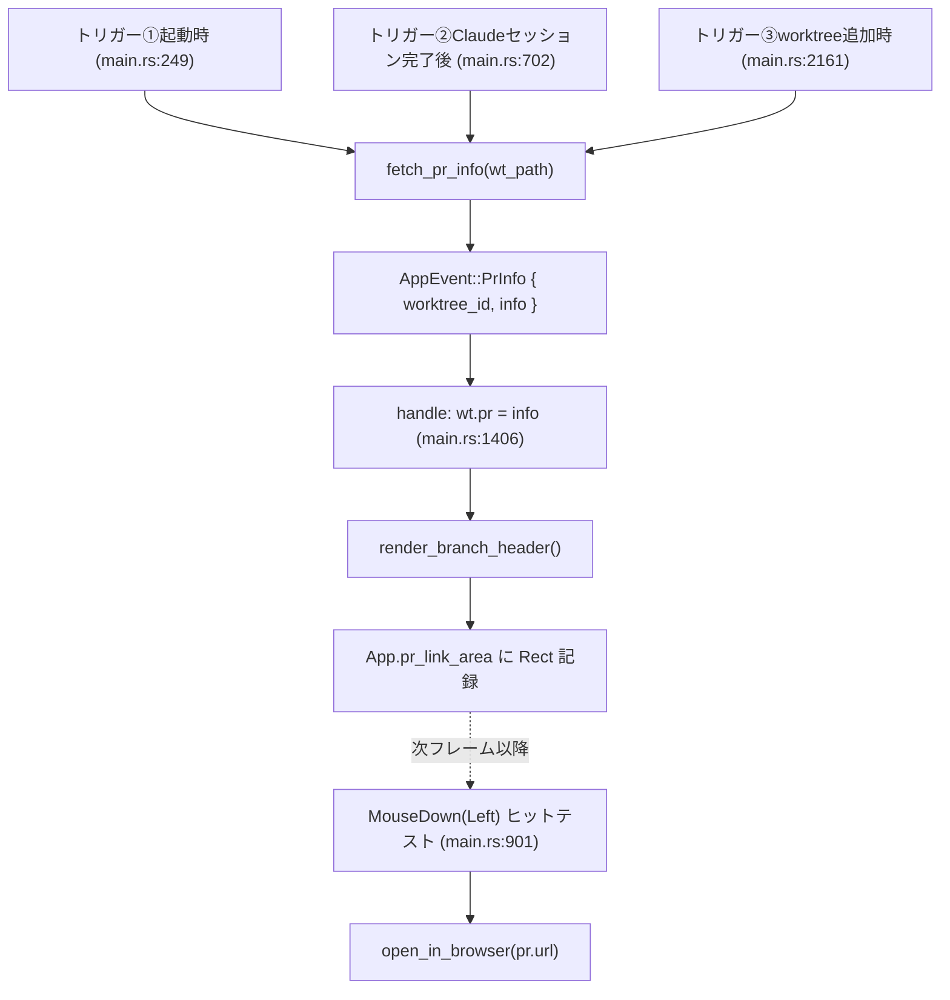
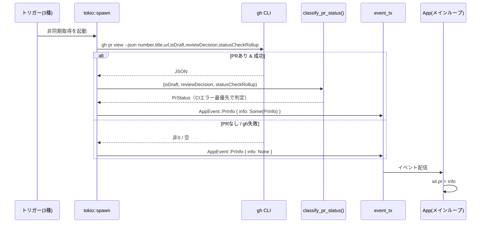
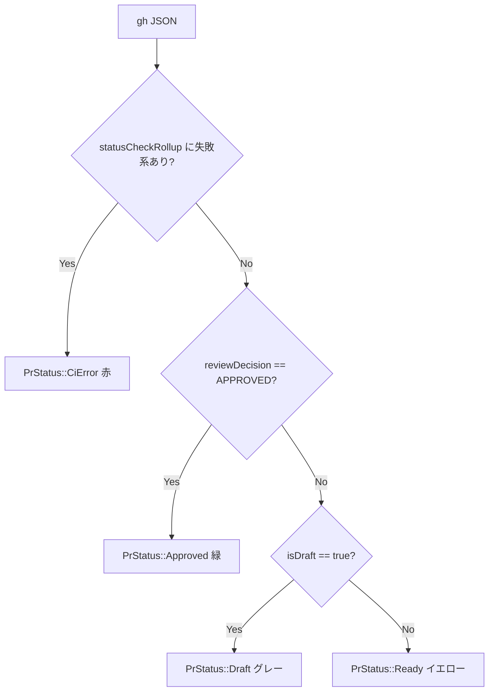
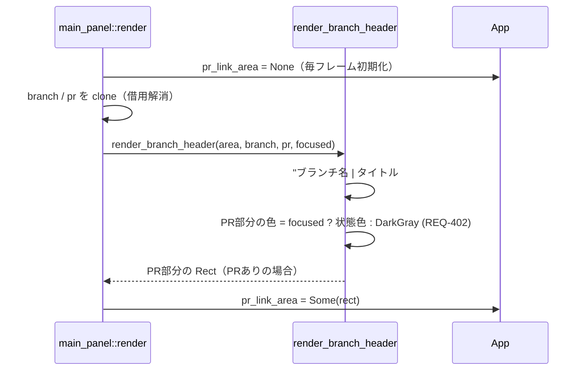
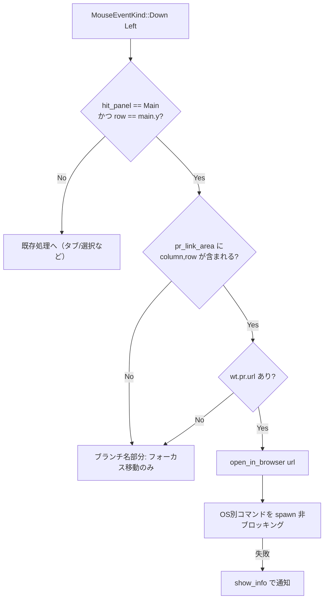

# PRヘッダー強化 データフロー図（軽量設計）

**作成日**: 2026-06-23
**関連アーキテクチャ**: [architecture.md](architecture.md)
**関連要件定義**: [requirements.md](../../spec/pr-header-enhancement/requirements.md)

**【信頼性レベル凡例】**:
- 🔵 **青信号**: 要件定義・ユーザヒアリング・既存実装を参考にした確実なフロー
- 🟡 **黄信号**: 要件・既存実装から妥当な推測によるフロー
- 🔴 **赤信号**: 根拠のない推測によるフロー

---

## 全体フロー 🔵

**信頼性**: 🔵 *既存データフロー + 本設計より*

PR 情報は「取得 → イベント → 状態更新 → 描画」の単方向で流れ、ユーザー操作（クリック）は
描画時に記録した矩形に対するヒットテストでブラウザ起動へ分岐する。

## フロー1: PR 情報の取得と状態判定 🔵

**信頼性**: 🔵 *requirements.md REQ-001/002/401 + 既存 fetch_pr_title より*
**関連要件**: REQ-001, REQ-002, REQ-401, REQ-403

### 状態判定フローチャート（classify_pr_status） 🔵

**信頼性**: 🔵 *requirements.md REQ-002 状態判定の詳細より*

> 失敗系 = CheckRun.conclusion ∈ {FAILURE, TIMED_OUT, ACTION_REQUIRED} または
> StatusContext.state ∈ {FAILURE, ERROR}。pending/running は失敗扱いせず通常判定へ（REQ-002）。🔵

## フロー2: ヘッダー描画とクリック領域記録 🔵

**信頼性**: 🔵 *既存 render() / render_branch_header (main_panel.rs:59,118) より*
**関連要件**: REQ-001, REQ-002, REQ-402, REQ-403

- 状態色の対応（フォーカス時）: `CiError→Red` / `Approved→Green` / `Draft→DarkGray` / `Ready→Yellow` 🔵
- PR が無い worktree では PR 部分を描かず `pr_link_area = None`（REQ-403）🔵

## フロー3: クリックでブラウザ起動 🔵

**信頼性**: 🔵 *requirements.md REQ-003 + 既存マウス分岐 (main.rs:901) より*
**関連要件**: REQ-003

- 反応範囲は `pr_link_area`（PR部分のみ）に限定（REQ-003、ブランチ名クリックは非反応）🔵
- `spawn` で UI をブロックせずブラウザ起動。失敗時はパニックせず通知 🟡

## エラー・縮退時の挙動 🔵

**信頼性**: 🔵 *既存実装（None フォールバック）より*

| 状況 | 挙動 |
|------|------|
| PR が存在しない | `pr = None` → ヘッダーに PR 表示なし・`pr_link_area = None`（クリック無反応） |
| `gh` 未インストール/未認証 | 取得失敗 → `info = None`（従来と同じ縮退） |
| `statusCheckRollup` が空（CI設定なし） | 失敗系なし → approved/draft/ready の通常判定 |
| ブラウザ起動コマンド失敗 | `show_info` で通知、UI は継続 |

## 関連文書

- **アーキテクチャ**: [architecture.md](architecture.md)
- **要件定義**: [requirements.md](../../spec/pr-header-enhancement/requirements.md)

## 信頼性レベルサマリー

- 🔵 青信号: 大半（取得・状態判定・描画・クリック・縮退）
- 🟡 黄信号: 2件（ブラウザ起動の非ブロッキング/失敗通知）
- 🔴 赤信号: 0件

**品質評価**: 高品質
