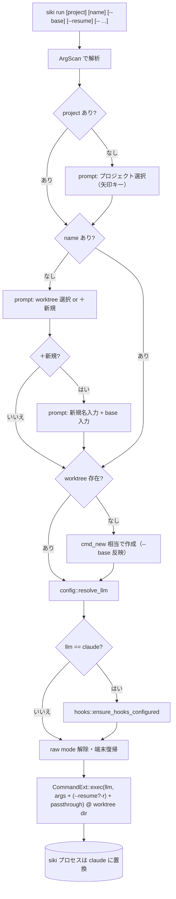
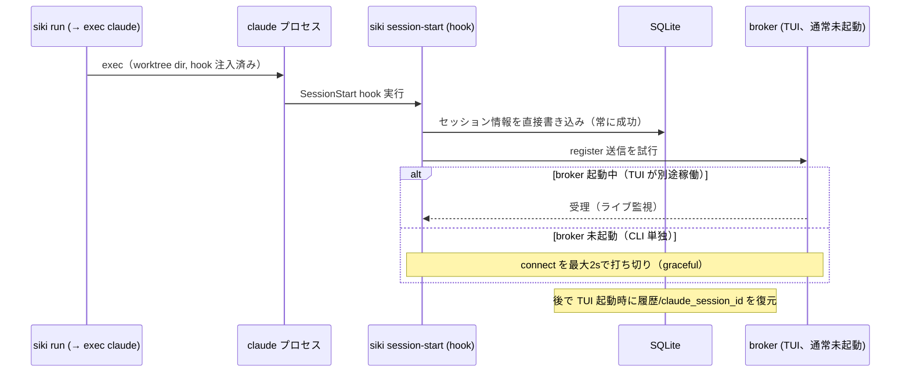
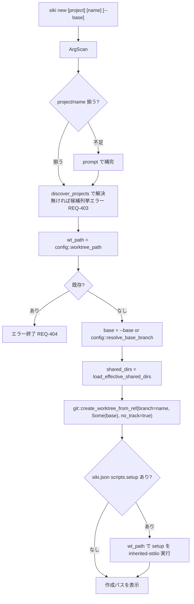
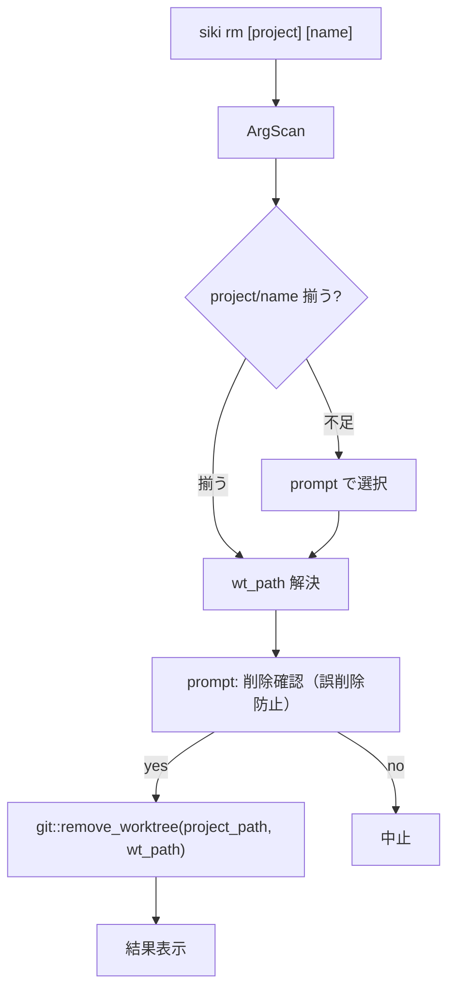
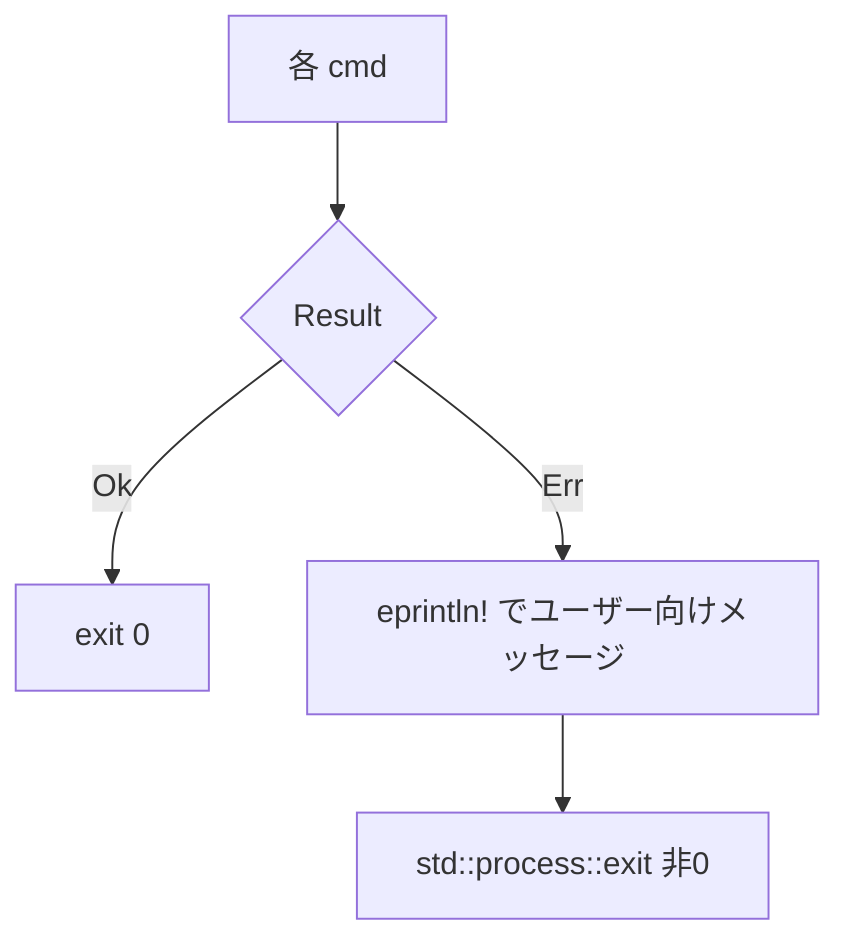

# siki 操作系 CLI データフロー図

**作成日**: 2026-06-30
**関連アーキテクチャ**: [architecture.md](architecture.md)
**関連要件定義**: [requirements.md](../../spec/siki-cli-commands/requirements.md)

**【信頼性レベル凡例】**:
- 🔵 **青信号**: 要件定義・既存コード・ユーザヒアリングを参考にした確実なフロー
- 🟡 **黄信号**: 妥当な推測によるフロー
- 🔴 **赤信号**: 根拠の薄い推測によるフロー

---

## 全体ディスパッチ 🔵

**信頼性**: 🔵 *main.rs:64-149 の既存ディスパッチ構造より*

```mermaid
flowchart TD
    A["siki &lt;args&gt;"] --> B{args[1]}
    B -->|"--version / --help"| Z1[既存処理]
    B -->|"mcp / session-start / hook-event"| Z2[既存の内部サブコマンド]
    B -->|"list [project]"| L[cli::cmd_list]
    B -->|new| N[cli::cmd_new]
    B -->|rm| R[cli::cmd_rm]
    B -->|path| P[cli::cmd_path]
    B -->|run| RUN[cli::cmd_run]
    B -->|なし / -p| T[TUI 起動（既存）]
```

## 引数パース（ArgScan）🔵

**信頼性**: 🔵 *ユーザヒアリング2026-06-30（手書き＋共有ヘルパ）より*

```mermaid
flowchart TD
    A["args[2..]"] --> B{各トークン}
    B -->|"--"| C[以降を rest（passthrough）へ]
    B -->|"--key（値フラグ）"| D[次トークンを values[key] へ]
    B -->|"--flag（真偽）"| E[flags へ追加]
    B -->|"-で始まる未知"| F[エラー: unknown flag]
    B -->|それ以外| G[positionals へ追加]
    C & D & E & G --> H[ArgScan 構築]
    H --> I["positionals(n) で過不足検証 / value(k) / has(k) / rest()"]
```

## run: 2モード（宣言 / 対話フォールバック）🔵

**信頼性**: 🔵 *ユーザヒアリング2026-06-30より*
**関連要件**: REQ-003, REQ-004, REQ-401, REQ-402



### run 起動後の hook → DB/broker 連携 🔵

**信頼性**: 🔵 *session_start.rs・broker 非起動時の graceful 設計より*
**関連要件**: REQ-402



## new: worktree 作成 🔵

**信頼性**: 🔵 *finalize_add_worktree(main.rs:2122) の非TUI部分の再現*
**関連要件**: REQ-001, REQ-002, REQ-403, REQ-404



## rm: worktree 削除 🔵

**信頼性**: 🔵 *git::remove_worktree(git.rs:190)・archive フロー(main.rs:4570)より*
**関連要件**: REQ-005



## path / list: 非対話 🔵

**信頼性**: 🔵 *ユーザヒアリング（スクリプト連携のため非対話）より*
**関連要件**: REQ-006, REQ-007

- `path <project> <name>`: `config::worktree_path` を**絶対パスで stdout に出力**。不足/不在は stderr + 非0終了。
- `list [project]`: `discover_projects` を列挙。project 指定時はそのプロジェクトのみ。

## エラーハンドリング方針 🟡

**信頼性**: 🟡 *coding-style.md（包括的エラー処理）・anyhow 既存利用より*



- プロジェクト/worktree 未解決、`--base` の値欠落、既存 worktree への new 等は anyhow の `Result` で
  ユーザー向けメッセージにして非0終了。対話中の Esc は中止（非0 or 0 は実装時に統一）。

## 関連文書

- **アーキテクチャ**: [architecture.md](architecture.md)
- **型/シグネチャ定義**: [interfaces.rs](interfaces.rs)
- **要件定義**: [requirements.md](../../spec/siki-cli-commands/requirements.md)

## 信頼性レベルサマリー

- 🔵 青信号: 8件 (80%)
- 🟡 黄信号: 2件 (20%)
- 🔴 赤信号: 0件 (0%)

**品質評価**: 高品質
