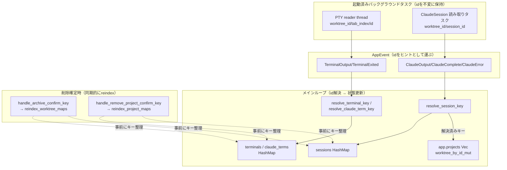

# worktree削除時のインデックス整合性修正 アーキテクチャ設計

**作成日**: 2026-07-01
**関連要件定義**: [requirements.md](../../spec/worktree-deletion-index-fix/requirements.md)
**ヒアリング記録**: [design-interview.md](design-interview.md)

**【信頼性レベル凡例】**:
- 🔵 **青信号**: 要件定義・設計ヒアリング・既存実装を参考にした確実な設計
- 🟡 **黄信号**: 要件・既存実装から妥当な推測による設計
- 🔴 **赤信号**: 根拠のない推測による設計

---

## システム概要 🔵

**信頼性**: 🔵 *requirements.md 概要より*

siki は `type WorktreeId = (usize, usize)` で `app.projects[pi].worktrees[wi]` を直接
インデックスし、同じ添字を `sessions`/`terminals`/`claude_terms` の `HashMap` キーにも
流用している。worktree・プロジェクトの削除で `Vec::remove` が起きるたびに後続要素の添字が
シフトするため、**削除確定時のインメモリ状態整合（reindex）** と、**既に起動済みの
バックグラウンドタスクが送るイベントのルーティング（id 解決）** という2つの独立した問題を
両方解消する。

## アーキテクチャ方針 🔵

**信頼性**: 🔵 *design-interview.md Q1〜Q3・既存実装(main.rs/terminal.rs/claude.rs/app.rs)の構造より*

- **パターン**: 既存の単方向データフロー（バックグラウンドタスク → `AppEvent` →
  メインループでの状態更新）を踏襲。新規レイヤは追加せず、既存4ファイル
  （`terminal.rs`／`claude.rs`／`event.rs`／`main.rs`）を拡張する。
- **id を「正」、index を「ヒント」にする**: `TerminalEmulator::id`（既存, `terminal.rs:42`）
  と同様の生成時点採番のグローバル一意 `id` を `ClaudeSession` にも新設する。イベント処理は
  まずイベントに乗った `(worktree_id, tab_index)` を高速パスとして試し、`id` が一致しなければ
  対象 `HashMap` 全体を `id` のみで再探索する。**worktree_id/tab_index はもはや「実体の所在を
  保証する鍵」ではなく「探索の手がかり」に格下げする**。
- **解決関数は用途ごとに個別実装**（ヒアリングQ1で決定）: `terminals`/`claude_terms`/
  `sessions` は値の型もマップの意味も異なるため、共通トレイトで無理に一本化せず、既存の
  `resolve_claude_term_key` と同じ形の小さな専用関数を3つ用意する（YAGNI）。
- **id 採番は用途ごとに独立**（ヒアリングQ2で決定）: `ClaudeSession` 用に `claude.rs` 内へ
  `NEXT_SESSION_ID: AtomicU64` を新設する。`terminal.rs::NEXT_TERMINAL_ID` とは共有しない
  （両者は無関係な概念であり、共有する結合度上のメリットがない）。
- **reindex は削除単位ごとに個別関数**（ヒアリングQ3で決定）: 既存 `reindex_worktree_maps`
  はそのまま維持し、プロジェクト削除用に `reindex_project_maps` を新設する。シフト対象の
  次元（`worktree_index` か `project_index` か）が異なり、無理な共通化はかえって複雑にする
  ため分離する。
- **イミュータブル**: reindex はいずれも「古いキーの値を取り出し、新しいキーへ挿入し直す」
  操作のみで、値自体（`TerminalEmulator`/`ClaudeSession`）は変更しない。

## 対象コンポーネント

### PTY ターミナル（`terminals`/`claude_terms`） 🔵

**信頼性**: 🔵 *コード調査 (`terminal.rs`, `main.rs:41-56,716-777`) より*

- **実体**: `TerminalEmulator`（`terminal.rs:41`）。生成時に `NEXT_TERMINAL_ID`（既存）から
  一意な `id: u64` を採番済み（変更なし）。
- **バックグラウンドタスク**: PTY reader thread（`terminal.rs:165`）。spawn 時にキャプチャした
  `worktree_id`/`tab_index`/`id` を `AppEvent::TerminalOutput`/`TerminalExited` に乗せ続ける
  （変更なし。これは正常な既存動作であり、受信側の解決ロジックを直す）。
- **変更点**:
  - `resolve_claude_term_key`（`main.rs:41-56`）: フォールバックの絞り込み条件
    `key.0 == worktree_id` を撤廃し、`claude_terms` 全体を `emu.id() == terminal_id` のみで
    走査するよう変更する（REQ-004）。
  - `terminals` 用に同型の新規ヘルパー `resolve_terminal_key` を追加し、`TerminalOutput`/
    `TerminalExited` 処理（`main.rs:747-751,772-776`）の直接キー引きを置き換える（REQ-005）。

### ヘッドレス Claude セッション（`sessions`） 🔵

**信頼性**: 🔵 *コード調査 (`claude.rs`, `app.rs:611-627`) より*

- **実体**: `ClaudeSession`（`claude.rs:11`）。`send_to_claude`（`main.rs:2228`）が
  ヘッドレスに起動する別系統の Claude 実行経路。
- **変更点**:
  - `ClaudeSession` に `id: u64` フィールドを新設し、生成時（`ClaudeSession::spawn`,
    `claude.rs:25`）に `NEXT_SESSION_ID`（新設 `AtomicU64`）から採番する（REQ-002）。
  - 読み取りタスク（`claude.rs:102` `read_stdout_task` 等）が送る `AppEvent::ClaudeOutput`/
    `ClaudeComplete`/`ClaudeError` に `session_id: u64` を追加する。
  - `sessions` 用の新規ヘルパー `resolve_session_key` を追加し、`id` 一致で「現在のキー
    `(pi, wi)`」を特定する。イベント処理（`main.rs:654-690`）はこの**解決済みキー**を
    `app.worktree_by_id_mut`/`app.worktree_by_id` に渡す。イベントに乗ってきた古い
    `worktree_id` を worktree 特定に直接使わない（REQ-006）。

### Reindex（削除確定時のキー付け替え） 🔵

**信頼性**: 🔵 *コード調査 (`main.rs:4417-4634`) より*

- `reindex_worktree_maps`（既存, `main.rs:4592`）: worktree 削除時、同一プロジェクト内で
  削除位置より後ろの `worktree_index` を持つ `sessions`/`terminals`/`claude_terms` のキーを
  1つ前方へシフトする。**変更なし（現行動作を維持）**。
- `reindex_project_maps`（新設）: プロジェクト削除時、削除位置より後ろの `project_index` を
  持つ `sessions`/`terminals`/`claude_terms` のキーを1つ前方へシフトする。
  `handle_remove_project_confirm_key`（`main.rs:4417`）の `app.projects.remove(pi)`
  （`main.rs:4460`）直後、既存の `selected_worktree` 補正（`main.rs:4463-4469`）と並んで
  呼び出す（REQ-102, REQ-103）。

> **なぜ reindex と id 解決の両方が必要か**: reindex だけでは「既に生存しているバックグラウンド
> タスクが古い識別子でイベントを送り続ける」問題（Bug A/B の本質）を解決できない。id 解決だけ
> では `sessions`/`terminals`/`claude_terms` に古いキーのエントリが溜まり続け、`selected_worktree`
> のような**イベントを介さない直接の Vec インデックス参照**（`app.rs:611-621`）は補正されない。
> 両方を組み合わせて初めて Bug A・B・C すべてが解消する。

## システム構成図



## データモデル（Rust 型定義） 🔵

**信頼性**: 🔵 *requirements.md REQ-001/002/006・design-interview.md Q2 より*

### `claude.rs` の変更

```rust
use std::sync::atomic::{AtomicU64, Ordering};

/// ClaudeSession のグローバル一意 id 採番用カウンタ
/// terminal.rs::NEXT_TERMINAL_ID とは独立（design-interview.md Q2）
static NEXT_SESSION_ID: AtomicU64 = AtomicU64::new(1);

pub struct ClaudeSession {
    id: u64, // 🔵 REQ-002: 生成時点で不変の一意id。id解決の正とする
    worktree_id: WorktreeId, // 既存: reader task 起動時に captureされる値（ヒント用途に格下げ）
    // ...既存フィールド
}

impl ClaudeSession {
    /// 生存期間中不変の一意id
    pub fn id(&self) -> u64 { self.id } // 🔵 TerminalEmulator::id() と同形

    pub async fn spawn(
        path: &Path,
        event_tx: mpsc::UnboundedSender<AppEvent>,
        worktree_id: WorktreeId,
        resume_id: Option<&str>,
    ) -> Result<Self> {
        let id = NEXT_SESSION_ID.fetch_add(1, Ordering::Relaxed); // 🔵 REQ-002
        // ...既存の起動処理
        // read_stdout_task の spawn 時に id を追加でキャプチャして渡す
    }
}
```

### `event.rs` の変更

```rust
AppEvent::ClaudeOutput {
    worktree_id: WorktreeId,
    session_id: u64,           // 🔵 新規: REQ-006 の id 解決に使用
    event: ClaudeStreamEvent,
},
AppEvent::ClaudeComplete {
    worktree_id: WorktreeId,
    session_id: u64,           // 🔵 新規
},
AppEvent::ClaudeError {
    worktree_id: WorktreeId,
    session_id: u64,           // 🔵 新規
    error: String,
},
```

### `main.rs` の変更（解決ヘルパー）

```rust
/// terminals 用の id ベース再解決ヘルパー（resolve_claude_term_key と対になる新設関数）
/// REQ-005: 現状 terminals には再探索処理が存在せず、直接キー引きのみだったギャップを埋める
fn resolve_terminal_key(
    terminals: &HashMap<TerminalKey, terminal::TerminalEmulator>,
    worktree_id: app::WorktreeId,
    tab_index: usize,
    terminal_id: u64,
) -> Option<TerminalKey> {
    if let Some(emu) = terminals.get(&(worktree_id, tab_index)) {
        if emu.id() == terminal_id {
            return Some((worktree_id, tab_index));
        }
    }
    // REQ-005: worktree_id 自体がシフトしていても見つけられるよう、
    // key.0 を絞り込まずマップ全体を id のみで走査する
    terminals
        .iter()
        .find(|(_, emu)| emu.id() == terminal_id)
        .map(|(key, _)| *key)
}

/// sessions 用の id ベース再解決ヘルパー
/// REQ-006: 見つかった「現在のキー」を worktree 特定に用いる（イベントの古い worktree_id は使わない）
fn resolve_session_key(
    sessions: &HashMap<app::WorktreeId, claude::ClaudeSession>,
    worktree_id: app::WorktreeId,
    session_id: u64,
) -> Option<app::WorktreeId> {
    if let Some(session) = sessions.get(&worktree_id) {
        if session.id() == session_id {
            return Some(worktree_id);
        }
    }
    sessions
        .iter()
        .find(|(_, session)| session.id() == session_id)
        .map(|(key, _)| *key)
}
```

`resolve_claude_term_key`（既存）は REQ-004 に従い、フォールバックの `find` から
`key.0 == worktree_id` 条件を削除するのみ（シグネチャ変更なし）。

### `main.rs` の変更（reindex_project_maps 新設）

```rust
/// プロジェクト削除後、削除位置より後ろの project_index を持つ
/// sessions / terminals / claude_terms のキーを1つ前にずらす
/// REQ-102: reindex_worktree_maps と対になる、project_index シフト用の新設関数
fn reindex_project_maps(
    sessions: &mut HashMap<app::WorktreeId, claude::ClaudeSession>,
    terminals: &mut HashMap<TerminalKey, terminal::TerminalEmulator>,
    claude_terms: &mut HashMap<(app::WorktreeId, usize), terminal::TerminalEmulator>,
    removed_project_index: usize,
) {
    let keys: Vec<_> = sessions
        .keys()
        .filter(|(pi, _)| *pi > removed_project_index)
        .cloned()
        .collect();
    for (pi, wi) in keys {
        if let Some(val) = sessions.remove(&(pi, wi)) {
            sessions.insert((pi - 1, wi), val);
        }
    }

    let keys: Vec<_> = terminals
        .keys()
        .filter(|((pi, _), _)| *pi > removed_project_index)
        .cloned()
        .collect();
    for ((pi, wi), tab) in keys {
        if let Some(val) = terminals.remove(&((pi, wi), tab)) {
            terminals.insert(((pi - 1, wi), tab), val);
        }
    }

    let keys: Vec<_> = claude_terms
        .keys()
        .filter(|((pi, _), _)| *pi > removed_project_index)
        .cloned()
        .collect();
    for ((pi, wi), tab) in keys {
        if let Some(val) = claude_terms.remove(&((pi, wi), tab)) {
            claude_terms.insert(((pi - 1, wi), tab), val);
        }
    }
}
```

呼び出し箇所は `handle_remove_project_confirm_key`（`main.rs:4417`）内、
`app.projects.remove(pi)`（`main.rs:4460`）の直後（既存の `selected_worktree` 補正
`main.rs:4463-4469` と並べる）。

## 非機能要件の実現方法

### パフォーマンス 🟡

**信頼性**: 🟡 *NFR-001（requirements.md）より*

- id 一致による `HashMap` 全体走査は O(n)（n = 対象マップの全エントリ数）。README記載の
  実利用規模（1 worktree あたり最大5ターミナルタブ + Claude タブ）を踏まえると、通常運用で
  n は数十件程度に収まり、メインループの1イベント処理あたりのオーバーヘッドとして無視できる。
- 高速パス（イベントに乗った `(worktree_id, tab_index)` での直接キー引き）を先に試すため、
  reindex が発生していない大多数のケースでは O(1) のまま変わらない。

### セキュリティ

該当なし（ローカルプロセス内のインメモリ状態管理のみで、外部入力・認証・暗号化は関与しない）。

### 保守性 🟡

**信頼性**: 🟡 *NFR-101（requirements.md）より*

- 3つの解決ヘルパー（`resolve_claude_term_key`／`resolve_terminal_key`／
  `resolve_session_key`）は「まず直接キー引き→ダメなら id のみで全体走査」という共通の
  **手続きパターン**を踏襲する（trait による共通化はしないが、コメントで同一パターンである
  ことを明記し、将来同種のマップが増えた際に迷わず追従できるようにする）。
- `reindex_worktree_maps`／`reindex_project_maps` も同様に「削除位置より後ろのキーを
  収集 → remove → 新キーで insert」という共通パターンを踏襲する。

### スケーラビリティ・可用性

該当なし（シングルユーザー・ローカル TUI プロセスであり、水平スケーリングや高可用性の
要件は存在しない）。

## 技術的制約

### パフォーマンス制約 🔵

**信頼性**: 🔵 *requirements.md NFR-001より*

- id 解決の全体走査を追加しても、既存のメインループ（`tokio::select!` ベースのイベント
  ループ、`main.rs`）の応答性を体感できるレベルで劣化させてはならない。

### 互換性制約 🔵

**信頼性**: 🔵 *requirements.md REQ-403・design-interview.md（要件フェーズ）Q3より*

- `AppEvent`/`ClaudeSession` は内部プロトコルであり、外部（MCP クライアント等）に公開される
  シリアライズ形式ではないため、フィールド追加による破壊的変更を気にする必要はない。

### スコープ制約 🔵

**信頼性**: 🔵 *requirements.md REQ-401/402より*

- id 不一致（実体が既に消滅）の場合はログを追加せず、現行通りイベントを黙って破棄する。
- `archive_target`/`rename_worktree_target`/`session_choice_wt_id`/`llm_picker_wt_id` 等の
  モーダル系 `WorktreeId` フィールドは変更しない。

## 関連文書

- **データフロー**: [dataflow.md](dataflow.md)
- **型定義（差分サマリ）**: [interfaces.rs](interfaces.rs)
- **要件定義**: [requirements.md](../../spec/worktree-deletion-index-fix/requirements.md)

## 信頼性レベルサマリー

- 🔵 青信号: 15件 (83%)
- 🟡 黄信号: 3件 (17%)
- 🔴 赤信号: 0件 (0%)

**品質評価**: 高品質（全変更箇所をコード上の具体的な行・関数まで特定済み。パフォーマンス・
保守性の記述のみ定量目標がなく🟡）
