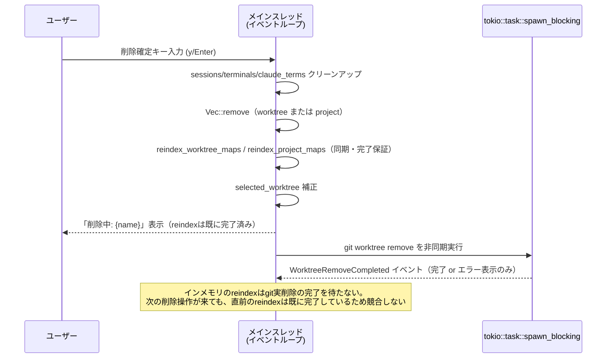
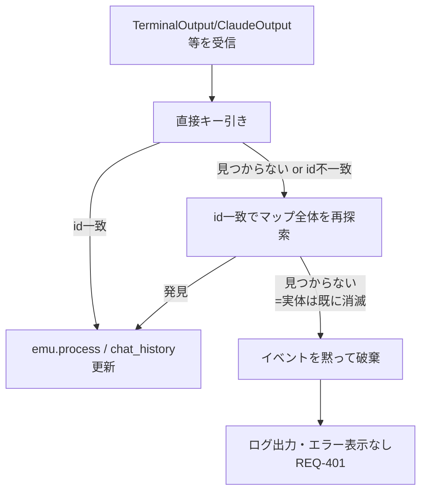

# worktree削除時のインデックス整合性修正 データフロー図

**作成日**: 2026-07-01
**関連アーキテクチャ**: [architecture.md](architecture.md)
**関連要件定義**: [requirements.md](../../spec/worktree-deletion-index-fix/requirements.md)

**【信頼性レベル凡例】**:
- 🔵 **青信号**: 要件定義・設計ヒアリング・既存実装を参考にした確実なフロー
- 🟡 **黄信号**: 要件・既存実装から妥当な推測によるフロー
- 🔴 **赤信号**: 根拠のない推測によるフロー

---

## 修正前の問題フロー（Bug A: PTYタブのフリーズ） 🔵

**信頼性**: 🔵 *コード調査 (`main.rs:41-56,716-751`) + ユーザー実環境再現より*

```mermaid
sequenceDiagram
    participant PTY as PTY reader thread<br/>(worktree_id=(pi,3)を保持)
    participant Loop as メインループ
    participant Map as claude_terms<br/>HashMap
    participant Del as handle_archive_confirm_key

    Note over Map: toronto の TerminalEmulator(id=42)が<br/>キー (pi,3) で存在
    Del->>Map: 指揮者(wi=2)を削除 → reindex_worktree_maps
    Map->>Map: キー (pi,3) → (pi,2) へ移動
    PTY->>Loop: TerminalOutput{worktree_id=(pi,3), terminal_id=42, ...}
    Loop->>Map: resolve_claude_term_key(worktree_id=(pi,3), ...)
    Note over Loop,Map: フォールバックが key.0==(pi,3) に限定<br/>→ 実体は(pi,2)にあるため見つからない
    Loop-->>PTY: (イベントdrop。画面が更新されない = フリーズ)
```

## 修正後のフロー（Bug A 解消） 🔵

**信頼性**: 🔵 *architecture.md「対象コンポーネント」より*

**関連要件**: REQ-003, REQ-004

```mermaid
sequenceDiagram
    participant PTY as PTY reader thread<br/>(worktree_id=(pi,3)を保持)
    participant Loop as メインループ
    participant Map as claude_terms<br/>HashMap
    participant Del as handle_archive_confirm_key

    Note over Map: toronto の TerminalEmulator(id=42)が<br/>キー (pi,3) で存在
    Del->>Map: 指揮者(wi=2)を削除 → reindex_worktree_maps
    Map->>Map: キー (pi,3) → (pi,2) へ移動
    PTY->>Loop: TerminalOutput{worktree_id=(pi,3), terminal_id=42, ...}
    Loop->>Map: resolve_claude_term_key(worktree_id=(pi,3), id=42)
    Map-->>Loop: 直接キー引き失敗 → id=42のみでmap全体を走査 → (pi,2)を発見
    Loop->>Map: claude_terms[(pi,2)].process(&data)
    Note over Loop: toronto のタブが引き続き更新される
```

**詳細ステップ**:
1. `指揮者` 削除確定で `reindex_worktree_maps` が `toronto` のエントリを `(pi,3)`→`(pi,2)`
   へ移動する
2. `toronto` の PTY reader thread は spawn 時の `worktree_id=(pi,3)` を使い続けて
   `TerminalOutput` を送る（変更しない、既存の正常動作）
3. `resolve_claude_term_key` はまず `(pi,3)` で直接引きを試みて失敗し、次に
   `key.0 == worktree_id` という制限を外した全体走査で `terminal_id=42` の一致を見つけ、
   現在の正しいキー `(pi,2)` を返す（REQ-004）
4. メインループはこの解決済みキーで `claude_terms.get_mut` して `emu.process(&data)` を呼ぶ

## 修正後のフロー（Bug B 解消: ClaudeSession の内容差し替わり防止） 🔵

**信頼性**: 🔵 *architecture.md「ヘッドレスClaudeセッション」より*

**関連要件**: REQ-002, REQ-006

```mermaid
sequenceDiagram
    participant CS as ClaudeSession読み取りタスク<br/>(worktree_id=(pi,2), session_id=7)
    participant Loop as メインループ
    participant SMap as sessions HashMap
    participant App as app.projects (Vec)

    Note over SMap: worktree削除でAのClaudeSessionは<br/>キー(pi,1)にシフト済み（reindex_worktree_maps）
    CS->>Loop: ClaudeOutput{worktree_id=(pi,2), session_id=7, event}
    Loop->>SMap: resolve_session_key(worktree_id=(pi,2), session_id=7)
    SMap-->>Loop: 直接キー引き失敗 → session_id=7のみで全体走査 → (pi,1)を発見
    Loop->>App: app.worktree_by_id_mut((pi,1)) で chat_history を更新
    Note over App: (pi,2)（シフト後に来た別の実在worktree）は<br/>誤って更新されない
```

**詳細ステップ**:
1. worktree 削除により、worktree A の `ClaudeSession` が `sessions` 内で `(pi,2)`→`(pi,1)`
   へシフトする
2. A の読み取りタスクは spawn 時の `worktree_id=(pi,2)` を使い続けて `ClaudeOutput` を送る
3. `resolve_session_key` が `session_id=7` の一致で現在の正しいキー `(pi,1)` を特定する
4. メインループはこの**解決済みキー `(pi,1)`** で `app.worktree_by_id_mut` を呼ぶ
   （イベントの `worktree_id=(pi,2)` を直接使わない）ため、シフト後に `(pi,2)` へ来た
   別の実在 worktree の `chat_history` を誤って上書きしない

## プロジェクト削除フロー（Bug C 解消） 🔵

**信頼性**: 🔵 *architecture.md「Reindex」より*

**関連要件**: REQ-102, REQ-103

```mermaid
flowchart TD
    A[プロジェクト削除確定<br/>handle_remove_project_confirm_key] --> B[削除対象プロジェクトの<br/>sessions/terminals/claude_terms を除去]
    B --> C[app.projects.remove(pi)]
    C --> D[reindex_project_maps(pi)<br/>新設]
    D --> E{sessions/terminals/claude_terms に<br/>project_index > pi のキーがあるか}
    E -->|あり| F[該当キーを (pi', wi) → (pi'-1, wi) へ移動]
    E -->|なし（末尾削除・単一プロジェクト等）| G[何もしない]
    F --> H[selected_worktree の project_index を補正]
    G --> H
    H --> I[削除完了]
```

## 削除操作全体のシーケンス（reindexは同期・実削除は非同期） 🔵

**信頼性**: 🔵 *既存実装 (`main.rs:4556,4566-4576`) のスレッドモデルより*

**関連要件**: EDGE-002



## エラーハンドリングフロー（id不一致時） 🔵

**信頼性**: 🔵 *requirements.md REQ-401・design-interview.md（要件フェーズ）Q5より*



## データ整合性の保証 🔵

**信頼性**: 🔵 *architecture.md「アーキテクチャ方針」より*

- **reindex の同期性**: `reindex_worktree_maps`/`reindex_project_maps` はいずれもメイン
  スレッド上で削除確定処理の一部として同期的に完了する。`git worktree remove` の実削除
  （`tokio::task::spawn_blocking`）は非同期だが、これはインメモリ状態と独立しており
  reindex の完了を妨げない（EDGE-002）。
- **id の不変性**: `TerminalEmulator::id`/`ClaudeSession::id` は生成時に採番されて以降、
  生存期間中変更されない。reindex はキー（Vecインデックス由来の添字）だけを付け替え、
  id と値そのものには一切触れない。

## 関連文書

- **アーキテクチャ**: [architecture.md](architecture.md)
- **型定義（差分サマリ）**: [interfaces.rs](interfaces.rs)
- **要件定義**: [requirements.md](../../spec/worktree-deletion-index-fix/requirements.md)

## 信頼性レベルサマリー

- 🔵 青信号: 8件 (100%)
- 🟡 黄信号: 0件 (0%)
- 🔴 赤信号: 0件 (0%)

**品質評価**: 高品質（すべてのフローがコード調査またはユーザー実環境再現で裏付けられている）
